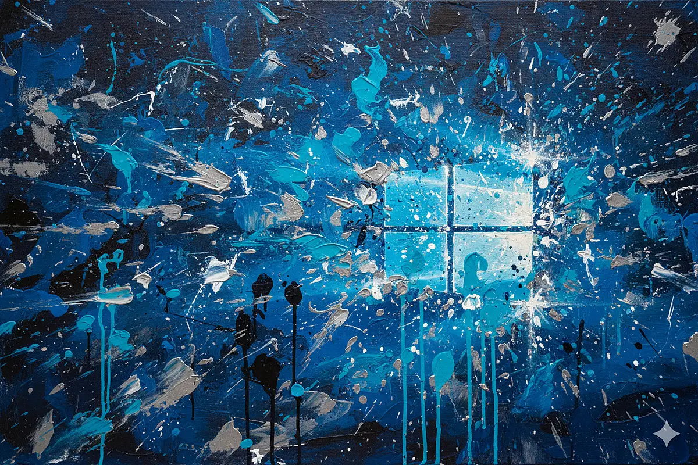

 

私は生粋の **MacBook ユーザー**であり、故スティーブ・ジョブズの崇拝者である。

MacBook、、嗚呼美しきかな。その端末の美しさはさることながら、画面を開くと眼前に並ぶ美しいアプリアイコンたち。スッと目に馴染む滑らかなフォント。ユーザーが目にする必要のない余計なものは表示せず、その画面はシンプルで合理的、そして簡素で、、美しい。

 

何よりこの神がかり的に優秀な**トラックパッド**である。3本指、上下左右のスワイプが、あなたを絡繰の魔術師へと変貌させる。3本指左右スワイプでフルスクリーンウィンドウ間の移動、上スワイプでそのウィンドウたちを画面上部に集結（Mission Control）、それらをドラッグ&ドロップで並び替え、下スワイプで作業画面へ。。デスクトップを中心に、その右はコードエディタ、その右はブラウザ、その右はメモアプリ、などと自分なりに配置を固定することで、スワイプ前から左右どちらに何度スワイプすれば目的地に辿り着けるのかを明確に意識でき、作業時のストレスを大幅減できる。

 

そして効率厨はここで止まらない。作業のうち、多くの時間を割くのは**ブラウザ検索**である。あらゆる調べ物をするため、幾度となく新規タブを作成し、幾度となくタブを閉じる。その度にカーソルをブラウザ上部、タブ右側のプラスボタン、バツボタンまで移動させるのは非常に手間である。あなたが日々バトロワゲームに興じ、即座にエイムを合わせる必要があるのなら、この操作は訓練として非常に有効だろう。だが私には不要だ。日々人を殺すゲームに興じるほど私の心はまだ荒んでいない。

すると考えるのはキーボードショートカットだ。`⌘(Command)キー + T` で新規タブの作成、`⌘ + W` でタブの削除。指の動きを固定することで、毎度違う場所にあるカーソルを毎度位置の変わるターゲットに向けて長い距離移動させる必要がなくなる。決まった位置のキーを押せば、毎度確実にヘッドショットが決まるのである。

 

だが私は**キーボードに手を伸ばしたくすらない**。2本指スクロールで記事を読み進めている私の右手を、トラックパッドから離れさせる手間を惜しむ。私が取った選択はこうだーー3本指上スワイプに `⌘T` を設定、3本指下スワイプに `⌘W` を設定。するとどうだ、トラックパッドを離れずにタブの作成・削除ができてしまう。従来の挙動は代わりに4本指でやるように設定する。

キーワード入力で結局手をキーボードに移動させるじゃないか！と思ったかもしれない。その通りである。しかし大事なのはキーボードに手を移動させる回数を減らし、トラックパッドによる手のひらの支配率を高めることである。落ち着け、まだ慌てるような時間じゃない。試合を長い目で見たとき、基本手のひらはトラックパッドに常駐させ、無駄な動きを省いてタイトに動く。それが選手の疲労度を下げ、作業効率の向上につながるんだ。

 

なんなら新規タブ立ち上げ後、ブックマークバーに登録したYouTubeをクリックするなら、キーワード入力すらいらない。そのYouTubeボタンはタブのプラス・バツボタンよりもかなり横幅があり、それらより少し下部に位置するため、かなり狙いやすい。そしてブラウザを閉じる動作に関しては、シンプルに手の移動料の削減であり、効率的である。

もう少し語らせてくれ。ブラウザ使用中、ある指をトラックパッドに置き、その左側の指でタップすると左側のタブに移動、右側の指タップで右タブに移動、と設定している（設定アプリ内で TipTap 右・左と呼ばれている）。これによりさらに多くの時間、右手をトラックパッドに滞在させることに成功した。

トラックパッド中心上部タップで音量アップ、下部タップで音量ダウンを設定している。快適なYouTubeライフの実現につながっている。

そしてマウスカーソル移動速度を最大値に設定、「タップでクリック」をオン（トラックパッドを押し込む代わりにタップ）、これらにより最高の作業環境を整えている。作業中の私は基本的にトラックパッドをこねくっているだけである。

## Windows 襲来

ここまでは前置きである。

ソフトウェア開発を生業とする私は、成り行きで建築関連の何かしらをAIで何かしらすることになった。**オッケーオッケー。**私は答えた。話を聞くに、私は建築ソフトのAIサポートプラグインを開発するっぽい。オッケーオッケー。

長らく待たされた挙句、私を雇う会社と建築系の先方との契約が決まったようで、私は作業を開始した。よーし、まずはその建築ソフトを触ってみっか。体験版インストール、っと。。

> 対応プラットフォーム：Windows 64-bit

 

わったふぁっく？

...待て待て待て待て。え？

 

Revit と呼ばれるそのソフトウェアは、Windows 専用であった。オゥマイ。私はなんとか MacBook で作業できないか考え、そしていっぱい調べた。無理だ。色々現実的じゃない。私はボスに報告した。「すません、Revit、Windows 専用みたいっす。。」

 

「オーケイ。Windows 手配できないか、先方に聞いてみるよ。」

 

終わった。私は一流のシステムエンジニアではあるが、それは私が MacBook を使いこなしててそれで気持ちよく作業しているからである。Windows 使えなんてそりゃ、バスケ選手に次のマンチェスター・シティ戦出ろって言うようなもんだぜ？マッチアップハーランドな。てなもんだぜ？違うか？違うか。落ち着け。まだ慌てるような時間じゃない。

しばらくし、私の手元に Windows パソコンが届いた。よーし、頑張りましょう。

 

私は MacBook の方が Windows パソコンよりも一般的に使いやすい、と信じている。特に技術職とかでない、一般ピーポーにとってなおさらそうだと思っている。ジョブズが使いやすさ、美しさを追求して作ったからだ、と思っている。ところが、公的機関ーー役所や学校の職員室にあるパソコンについて考えると、MacBook のイメージはない。つまり MacBook がいくらシンプルだろうが使いやすかろうが美しかろうが大好きだろうが、現実、多くの場所では Windows パソコンが使われている。

すると、いつか役所の人となんかしたり、学校の職員室でなんかしたりするときに、Windows パソコンが触れた方が話が早い、ということである。ちょ、これ分かんないんだけど。と聞かれた時に、うぉ、すません、自分 Windows パソコンわかんねーんすわ。。という代わりに、オッケーオッケー、見ますわ。とできるということである。役に立てるということである。

 

というわけで、私は Windows マスターになることにした。1ヶ月ほど Windows パソコンを触った結果感じた、苦しい点、嬉しい点などを発表します。

 

### 驚いた点

え？トラックパッド割と使えるやん。3本指操作あるやん。やるやん。

### 苦しい点

**3本指左右スワイプ** - 挙動が違う。。フルスクリーン間の移動じゃない。3本指横スワイプすると、画面中央に使用中ウィンドウがちっちゃく並ぶ。そのまま指を上下左右に動かすことで選択カーソルが移動し、指を離すとその画面に移動する。もう一度3本指横スワイプを始めると、先ほど選んだウィンドウが先頭に来ており、並び順が変わっている。つまりスワイプ前にスワイプ量と方向が予測できない。いやだ。

**4本指スワイプ** - デスクトップ間の移動。これで行けるか？と思ったが、3本指上スライドで画面上部にデスクトップたちがちっちゃく並ぶが、これらをドラッグ&ドロップで並べ替えることはできない。柔軟性に乏しい。うぐ。

**3本指上下スワイプ** でキーボードショートカットを実行するよう設定できるアプリはあったが、挙動が怪しかったのでやめた。

**TipTap 右・左** - 追い求めるユーザーのスレッドがいくつかあったが、結局無いっぽい。

**テキスト編集ショートカット** - Mac はデフォで以下ショートカットが使えて、効率的にテキスト編集ができる。Windows ではデフォでは使えないのでアプリとかで設定が必要。

- `Ctrl + H`: カーソル左1文字削除
- `Ctrl + D`: カーソル右1文字削除
- `Ctrl + K`: カーソル右全削除
- `Ctrl + B`: カーソルを←に移動
- `Ctrl + F`: カーソルを→に移動
- `Ctrl + P`: カーソルを↑に移動
- `Ctrl + N`: カーソルを↓に移動
- `Ctrl + A`: カーソルを文頭に移動
- `Ctrl + E`: カーソルを文末に移動

これができたら、右上の方にある Backspace, Delete に小指をグッと伸ばす必要がなくなる。右下の矢印キーたちまで小指をグッと伸ばし、安定しないまま小指操作でカーソル移動する必要がなくなる。Windows でも似たようなことができるようにカスタムしようかと思ったが、そんなの設定されてない Windows パソコンを誰かに渡された時、スムーズにそれを触れるようになっときたいので、やめといている。3ヶ月くらい経ったら多分やる。

### 嬉しい点

ダブルタップしてカーソル移動で範囲選択。最初誤爆するからオフにしようかと思ったけど、耐えて使ってたらこれ便利。Mac ではクリックして（トラックパッドを押し込んで）ドラッグする必要がある。タップじゃない。Mac でもオンにできたけど、動きもっさりしててやめた。

 

以上。

ブラウザタブの新規作成・削除、左右移動に関してはまあカスタムしててもいいかということで、エイミングせずにトラックパッドの近場で済ませるために以下を設定した。

- `Alt + N`: Ctrl + T（新規タブ作成）
- `Alt + M`: Ctrl + W（タブを閉じる）
- `Alt + ,`: Ctrl + PageUp（左タブに移動）
- `Alt + .`: Ctrl + PageDown（右タブに移動）

目視しないと打ちミスしちゃうので、目視のいらないトラックパッド操作に比べると少し劣る。が、しょうがない。できないんだもん。

 

画面デカいのはまぁなるほどって感じだけど重いんだよね君。重いならデカくせんでええわって感じです。今んとこ慣れたんで全然作業はできてます。ただ自分のことする時、YouTube みる時は MacBook でやりがちです。やっぱ MacBook いいすわ。気持ちい。あと Windows の方はまだ日本語設定してなくて ChatGPT に聞く時英文で聞くことを強制されるから甘えを断ててるってのがあります。あとミスって Mac で Windows のキー操作した時なんか発動して「え？お前そんなことできたんや」てなったりする。

 

まぁなんつーか、いい機会やと思てます。

