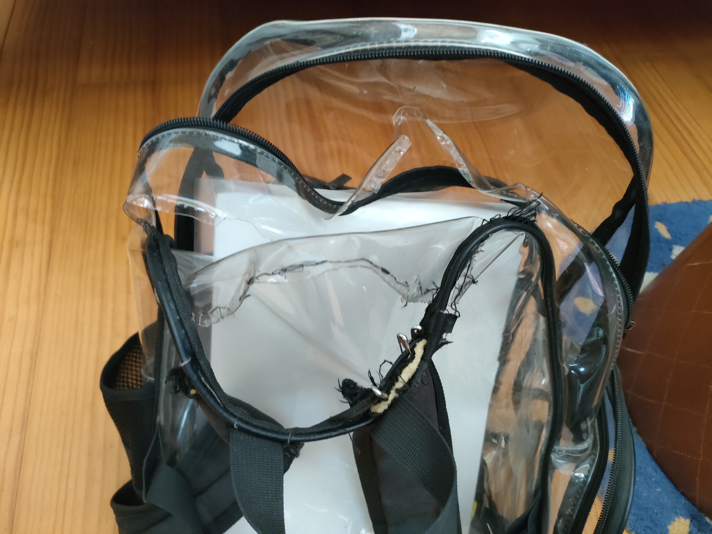

遡ること数年前、桑はとある企業にインターンシップとして参加していた。そこを辞める時、メンバーがちらほら物をくれた。

吉田くんはリュックをくれた。共に働いた同士が物をくれるなんて、何とも胸が熱くなる。目頭を抑えるのを堪えた手で、桑はそれを受け取った。そのリュックは、入れ口を折りたたんで留め具で閉じるタイプのやつであった。
 

ところで、桑がリュックに求める条件は以下である。

[**桑リュック条件**]
- 大き過ぎない
- 物が取り出しやすい
- 複数の小物ポケット（浅め）
- 横にドリンクポケット
 

吉田リュックから荷物を取り出す際、留め具を外し、入れ口をたくし上げ、床と垂直まで持っていく必要がある。その運動量たるや。そしてたくし上げられた入れ口の分、余分に深く手を伸ばす必要がある。

桑は瞬時に悟った。このリュックは俺のためのものではない。リュックから物を取り出し、そしてしまう。日常的に行われるその動作の度、「このリュックは俺のためのものではない。」そう脳裏によぎるのは明白であった。
 

「すまん、吉田くん、使いずらいけんいらねーわ。」そんな非道いことを告げる勇気は桑にはなかった。桑も人の子。職場を去る桑のため、リュックを選んでプレゼントしてくれた青年の思い。それを無下にするようなことは、人の心が許さなかった。

帰宅後、桑はメルカリを開き吉田リュックを出品した。6,700円で売れた。( ᐛ)ｳｪｰｲ⤴︎

利用可能期限が過ぎ、売上ポイントは霧散した。人を思った吉田くんの気持ちだけが、桑の心に今も深く刻まれている。
 

それはさておき、確か彼がリュックをくれたのは、その時桑が使っていたリュックがボロかったからだった気がする。見かねた吉田くんがリュックを買ってくれた、というわけだ。それを受け取りつつも採用しなかった桑は、引き続き元のリュックを使い続けていたようだ。しかしどうやらその3ヶ月後にAmazonでリュックを買っている。

<figure>
  
  <figcaption>透明リュック</figcaption>
</figure>

桑リュック条件を満たすものをAmazonで探した結果、透明になってしまった。しかしどうやらこのリュック、ベリーグッドである。
- 雨耐性◎
- 忘れ物チェック◎
- チャックを開ける前からものを取り出す経路を想像できる
 

透明リュックは桑の愛用品となっていた。毎日のように背負われたリュックの肩掛けは痛み、取れかかり、終いには空港で千切れて体から転がり飛んでいった。

何とかオペを施し、透明リュックは生命を繋ぎ止めた。そして緊急オペから一年ちょいたった今日まで何とか生き長らえている。

<figure>
  
  <figcaption>ギリギリの透明リュック</figcaption>
</figure>

もはやチャックを開かずとも中身が取り出せる始末である。雨耐性はゼロ。いつかまた破裂するかもしれないという恐怖感。

状況を鑑み、桑はこの度リュックを新調することにした。

<figure>
  
  <figcaption>2代目透明リュック</figcaption>
</figure>

2代目透明リュックである。

いいリュックがあれば買い替えようと意識しながら過ごしていた桑であったが、透明リュックを超えた機能性を誇るものには出会えずじまいであった。なので、2代目透明リュックである。

2代目、君はこれから私と旅路を共にし、その行く末を見守ることであろう。そして出会う人々もリュックの中身を見つめることであろう。( ᐛ)ｷｬｰ