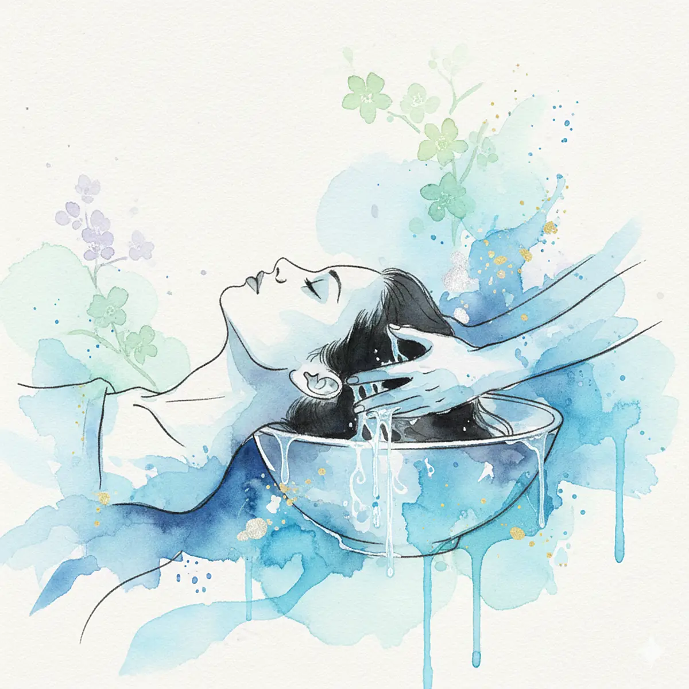

野暮用があってモールに向かった。バイクタクシーで向かったがその途中、工事中？の電柱からバチバチッ！！て音がして火の粉降ってきて「熱ッッつ！！」てなってTシャツに1mmくらいの穴あいた。ガチかよ。危っぶね。

 

モール帰り、ヘッドスパに寄った。ここに来るのは2回目である。2回目無料という謎システムで、その2回目を消費しに来た。2,000ペソ、6,000円弱で2回目無料。実質1回3,000円弱である。このヘッドスパ、当たりである。俺が「ヘッドスパとはかくあるべき」と思うようなサービスを提供している。ヘッドスパとはつまり、シャンプーである。床屋でシャンプーをしてもらうとき、あれが異常に気持ちいい。それをひたすらやってもらいたいから、ヘッドスパに行くのである。ドライヘッドスパではダメだ。水に濡らしていない状態で頭を揉む、そんなものじゃ俺の頭皮には響かない。シャンプーなのだ。水分を頭皮に巡らせた状態で、わしゃわしゃされたいのだ。ここは長いことシャンプーわしゃわしゃしてくれる。

加えて、肩周りのマッサージもついている。仰向けの状態で背中に手を差し込まれ、肩甲骨周りをグリングリンやられる。僧帽筋をブリンブリンやられる。色々終わった後座らされ、背中をトゥパットゥパッやられる。

エクセレント、アメイジングである。また気が向いたら来よう。ベリーグッド！