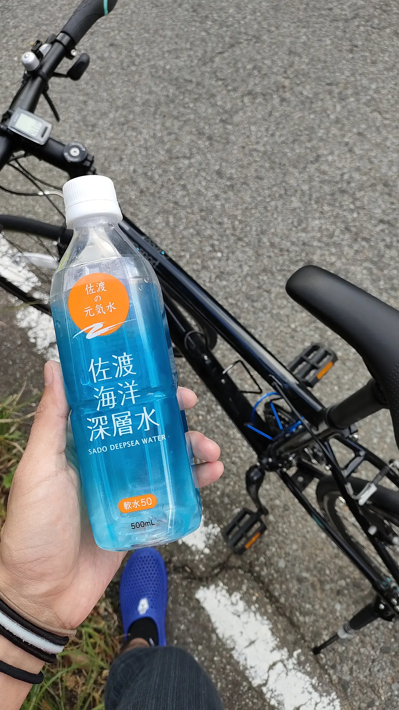
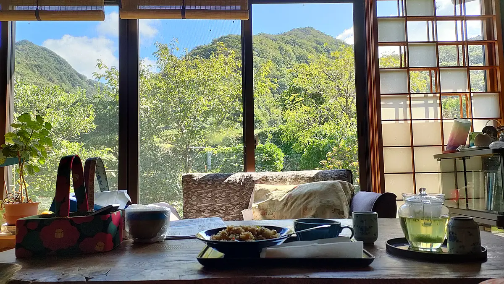

**佐渡**よかったよ、と2回ほど聞いたことがあった。ほないつか行こうかと思ってたので来た。2週間とか4週間とか居ながら、チャリで外周をゆっくり周ってみようと思った。宿でパソコン、昼夜外食、移動日エンジョイ、みたいなイメージ。

レンタサイクルの値段を調べたら5,000円/24hとか。x14日で7万円。高けえよ。島内にブックオフがあったのでそこまでバスで移動、中古でチャリが売ってないか探した。**クロスバイク**が売ってたのでそれを購入。**27,500円**。相棒、よろしくだぜ。島を出る時にまたここで売ることする。

<figure>
  
  <figcaption>佐渡海洋深層水と中古クロスバイク</figcaption>
</figure>

クロスバイク、**めちゃいいかも**。歩くより速い。車より怖くない。自分向きな気がする。素敵ポイントを分析しよう。

## クロスバイク素敵ポイント

### 1. 依存の少なさ
車を持つなら必要なもの
- 免許
- 自動車学校に通う
- 免許の更新
- 自動車保険
- 自動車税
- 車検
- ガソリン

自転車はそれらが必要ない。車両、周辺器具買ったなら後はたまにタイヤに空気入れるくらい。シンプル。美しい。

### 2. 維持費の安さ
依存が少ないが故に金もかからん。

### 3. 学習コスト・難易度の低さ
車は自動車学校に行く必要がある。車両感覚を掴むのにも時間がかかる。感覚掴めたとて上手に運転できるとは限らん。ルールも多い。自転車は公園で練習できる。車両感覚とかほぼない、自分の体とサイズ感一緒。

### 4. 危険度の低さ
車は車体が自分の体より大分大きく、操縦の難易度が高くて責任の範囲も広い。視野も自転車より限られている。高速で移動する中でたくさんの状況変化に対応しなきゃいけない。自分の責任じゃない事故に巻き込まれる確率も高い。日々幾千の車が2mにも満たない距離を高速ですれ違っている、人間マジかよ。すげーな。対向車が2mこちらにずれてくるかもしれない。。なんて考えてしまったなら最後、そうかもしれない無限の車とのすれ違いで、脳がかもしれないバーストである。

 

そのうち自分も車には乗るんだろう。ただ何というか、、割と学習コストが高く、危険度も高いものに、都会でもない限り依存しなきゃ生きていけない現実、世界が、、なんか気に食わん。美しくない。環境変化に対応できない個体は淘汰されるのみか。。しんどい。ぴえん。

## 差し込んだ光

クロスバイク初日、ケツがめちゃ痛くなった。調べたところ、サドルにあまり体重をかけないようにするのがいいとのこと。そのために**腹筋に力を入れる**といい、と。。

私が人生で諦めていたことが一つある。腹筋を鍛えること。背筋をピンと伸ばし、凛として佇みたいものである。その肝となるのは間違いなく腹筋、しかし。。ジムに通って自分の体を痛めつける、そんな変態性は私には備わっていない。ところが私の生活で腹筋に負荷がかかることなど皆無。私は腹筋を諦めていた。。が、しかし！！**クロスバイクという光が！そこに差し込んだ！！**——

<figure>
  
  <figcaption>差し込む光とお昼ご飯</figcaption>
</figure>

## 要は

**クロスバイクベリーグッド**ってこと。歩きで行く場合の1/3くらいの時間で行けるっぽい。歩き15時間ならチャリ5時間。佐渡一周したから少なくとも210kmはチャリ漕いだ。最後ブックオフで**12,000円**で売れた。27,500円 - 12,000円 = **15,500円**で25泊の佐渡を満喫。ベリーグッド。
