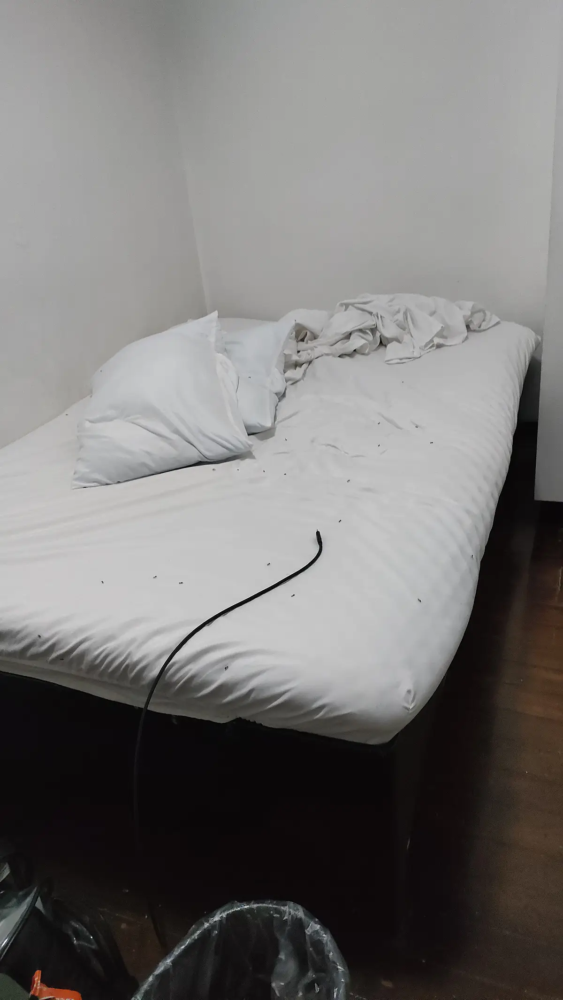
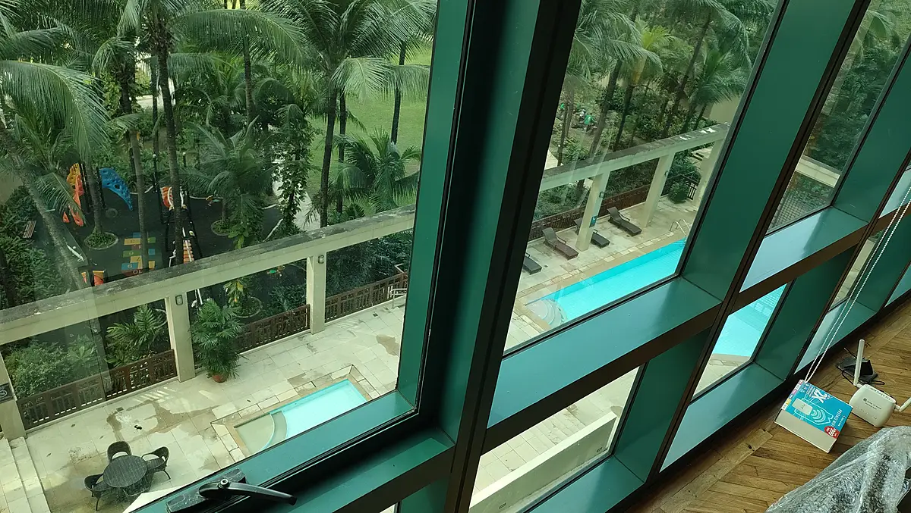
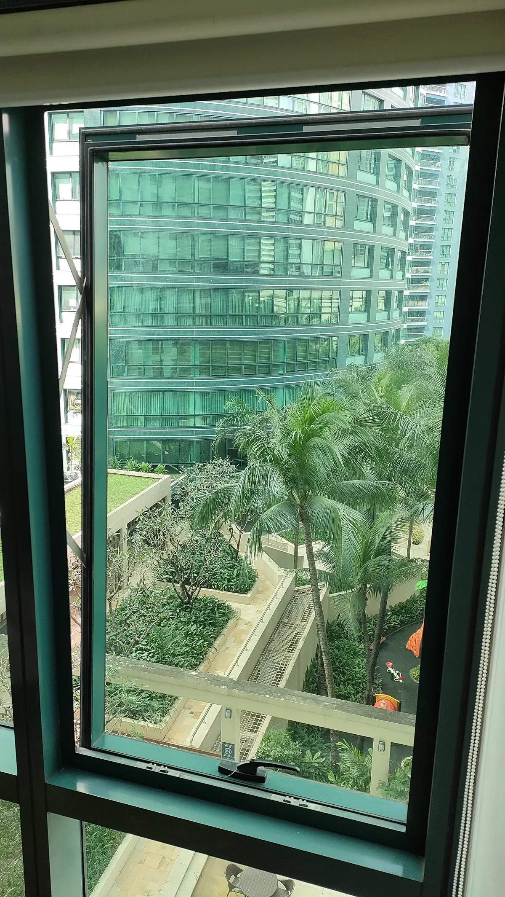
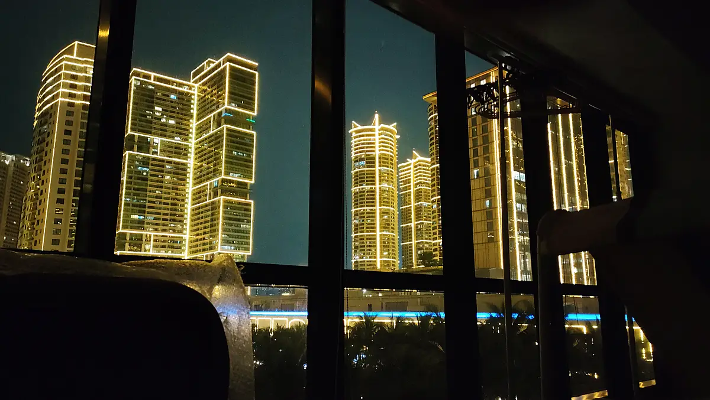

昔知り合ったフィリピン人の人が「フィリピンに会社作ったんだけど興味ある？」と声をかけてくれたので、そこで働くことに。そしてフィリピンに住んでみることに。

さて、そうと決まったもんだから、先々月、早速私はフィリピンに飛んだ。すると、ちょ、先方との契約とかまだだから来るの早いわ。と言われ、適当にその辺をフラフラして過ごしていた。その際、飯に困った。ショッピングモールで食べると高くつくし、ファストフードは全然まずいし、適当に入る店の料理なーんか微妙だし、野菜にありつくの難しいし。スーパーにお惣菜コーナーないし。。そうして1ヶ月ほどいた後日本に戻り、1ヶ月ほど経って契約が決まったとのことでまたマニラに戻ってきた。

 

住む場所を用意してくれるとのことで、「ここはどうだ？」と言われ、オーイェス、オッケーオッケーと答えた。そこはマニラのマカティシティにあり、準備できるまで時間がかかるとのこと。その辺の宿に泊まって待機することにした。

泊まっていたところは大きなモールや高いビルがある場所、からは少し離れた、それでいて人が多く、市場などがあって盛り上がっているところ、にあった。どう説明すればいいのか。栄えている、というには道きったねーしゴミいっぱい落ちてるし、ホームレスいるし猫の死体見かけるし、でも貧民街というほどでは無いかな？くらいのところ。庶民ゾーンとでも言おうか。

エアビーでとったその宿は、アパート2階の一室。その近場で飯を食って過ごすことにした。露店で、いろんな種類の料理、おかずがそれぞれ銀のプレートで並べられている店をよく見かける。カリンデリアと言うらしい。食べたいものを指差して注文し、米と一緒に頂く。

## 無限カリンデリア編

フィリピンはカリンデリアゲーであると気づいた。うまいもんが食いたいならカリンデリア、安く済ませたいならカリンデリア、ローカルを楽しみたいならカリンデリアである。1食200~400円で済むんじゃなかろうか。滞在中にどれだけ多くカリンデリアで飯を食えるか、これがフィリピン生活の本質である。

さぁいらっしゃい、なんにしやしょう？たくさん並んだ銀のプレート。その中から食べたいものを選ぶ。うまいのは肉を煮込んだ系のやつだ。サラサラめのソース・スープを纏ったものを選ぶのがいい。するとまぁ外さない、唸る旨さである。そして大抵、野菜系のおかずも置いてある。私は通常、旨そうな肉系のやつ、野菜系のやつ、ライスワンカップ、を選択する。たまにツーカップ行っちゃうこともある。日毎に並べられるおかずの種類が変わっている店もある。気になるものは気の向くままに選ぶがいい。

私は宿の近く、2つのカリンデリアを、毎日昼夜鬼ローテーションした。美味い。美味いぞ。素晴らしい。肉、野菜、米、水、これらを毎日摂取。なんとシンプル、そしてなんと豊かであろうか。そういやスープも頼めるわ。完璧。そんな生活をしているうちに、家が準備できたと連絡が来た。私はその庶民通りを後にし、新たな拠点へと向かった。

<figure>
  
  <figcaption>滞在先、晩飯から戻ると、照明にたかって落ちた羽アリだらけになってたベッド。全員つまんでペットボトルに閉じ込めてやった。くたばれ。</figcaption>
</figure>

## ラグジュアリー・コンドミニアム編

巨大なモールを囲み、聳え立つ高層ビル群。その中に、私の住処はあった。私は高級マンション街に住むようだ。スイミングプール、フィットネスセンター、ライブラリー、ランドスケープガーデン、ファンクションルームなど、充実した共用施設があるとのこと。なんだファンクションルームって。すげえ。

 

鍵を受け取る日、「鍵はアシスタントから受け取ってくれ。彼女が君を色々助ける。」と、部屋を準備してくれた人に言われ、私はマンションに向かった。アシスタント、と聞いていたので勝手に「スーツでビシッと決めた秘書」みたいな人を想像してたが、そこにいたのは小柄でふくよかな庶民の装いの中年女性、エマ（仮名）であった。エマと私はマンションに入り、部屋へと向かった。

エレベーターに向かう通路、床に何かが落ちていた。ん、紙幣か？と私が思うも束の間、エマはそれをパッと拾ってパッとしまった。ぁ取った！私は思った。そして何事もなかったかのようにエマは歩いた。エマは時折タガログ語で呟いたり、考えたりしている。話す感じ、英語はあまり得意では無いようだ。

 

部屋の鍵を開け中に入ると、いくらか家具が用意されていた。ベッド、ソファ、机、椅子、棚、。。十分である。ベッドはマットレスしかなかったため、シーツ、ブランケット、枕など、周辺用品をエマと買い出しに行くことにした。

<figure>
  
  <figcaption>プール。すげえ。</figcaption>
</figure>

買い出しから戻り、シーツをマットレスに被せようとすると、サイズが合わない。買い物失敗である。慌てるエマ。「み、見て、こっちにはハマるわ！」エマはシーツをサブのソファベッドの方に被せた。ん、ありがとう☺️。ブランケットはちょうどマットレスと同じサイズだったので、それをシーツ代わりにし、余ったシーツを掛け布団にして寝ることにした。

部屋の鍵につけるキーホルダーを買おうと思ってたのに忘れてたことに気づいた私は、もう一度モールに向かうことにした。サポート任務を終えたエマも共に部屋を後にすることに。部屋の入り口の玄関扉、これが開けるのも閉めるのもすっごい固ったい。かなり力を加えてガタッ！！と開き、かなり力を加えてガタッ！！と閉まる。エマは扉を閉めるのに苦戦した。引けども引けども閉まらない。ガタッ！！扉が閉まると共にエマは転げた。私たちは笑った。ちなみにバスルームの扉は力を加えるまでもなく、シンプルに引っかかって閉まらない。建て付けどうなってんねん。

 

数日後、私は部屋の窓が空いているのに気づいた。スライドするのではなく、窓の端を押し出して開くタイプの窓であり、上端の方がピロリと空いていた。いじってたら下端の方がガタッとかいってズレて、自力で閉められなくなった。私はエントランスに向かい、守衛の紳士に助けを求めた。「すません、部屋の窓閉めらんなくなりました。」「わかりました。では、あなたの部屋に**テクニシャン**を送りますので、お待ちください。」俺の部屋にテクニシャンを送るだと？テンションが上がった。部屋に戻り、空いたまま塞がらない窓を見つめながら、テクニシャンを待った。

<figure>
  
  <figcaption>閉められなくなった窓</figcaption>
</figure>

しばらくし、私の部屋に技術者（テクニシャン）の男性が来た。40代くらいだろうか。小柄であるが恰幅がよく、わずかににこやか。そして堂々としたその立ち姿からは、かなりの技術力が窺い知れた。

「こちらです。」私は案内した。テクニシャンは窓を観察し、動かし、確認し、言った。「Sir, 上側、ヒンジ、壊れてる。明日コンストラクター送る。」この窓、本来下側しか開かない仕様のようだ。おぅおぅ、ぶっ壊れとるやないか。「オーケイ、ありがとうございます。」私は答えた。彼は何やら窓をガタガタ動かし、持ち前のテクニックでそれを元の位置に戻して閉めた。ワォ、グレイト。私は言った。テクニシャンはニコリ微笑んだ。

「すません、ついでにドア見てもらえませんか？」私はテクニシャンに頼んだ。引っかかって閉まらないトイレのドアを彼に見せると、彼はそれを直しにかかった。蝶番を何やら叩き、押し込み、ねじ込み、そしてドア側面を削り、、見事にそれが閉まるようにした。「オゥ、グレイト、テンキュー。すいませんこっちも。。」彼は部屋入り口のドアもスムーズに閉まるようにした。見事。そして彼は部屋を後にした。ありがとうございます。。

 

翌日10AM、窓を直すため、部屋に4人の男が現れた。彼らは窓の下部を固定するネジを順番に外し、1人が細長い木材を窓の下に差し込んだ。そしてワン、ツー、スリーの掛け声と共に上部のネジを外し、3人が窓枠から外した重たい窓を全力で抱え、それを部屋の中に入れ込んだ。え？支え木材だけ？雑くね？怖くね？ロープ巻くとか、、私は思った。しかし素人が口を出すようなことではない。彼らは窓のパーツを付け替えると、また1人が窓枠から木材を突き出した。そしてその支えも頼りに窓を全力で抱え、順番にネジを付けていった。やがて窓の修理は完了した。お疲れ様です。。

<figure>
  
  <figcaption>なんか光ってる。すげえ。</figcaption>
</figure>

 

ここは飯場までの距離が遠い。エレベーターで下り、モールまで歩き、地下に下り、飲食店ゾーンで飯、が今の所王道ルートである。家目の前カリンデリアが恋しい。しかしここはここでインタレスティングな場所なので、満喫しようと思います。

とまぁ、新居での生活が始まった。しばらくいるので、遊びに来てネ。

