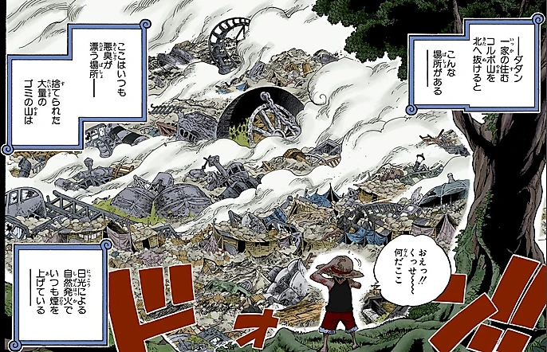
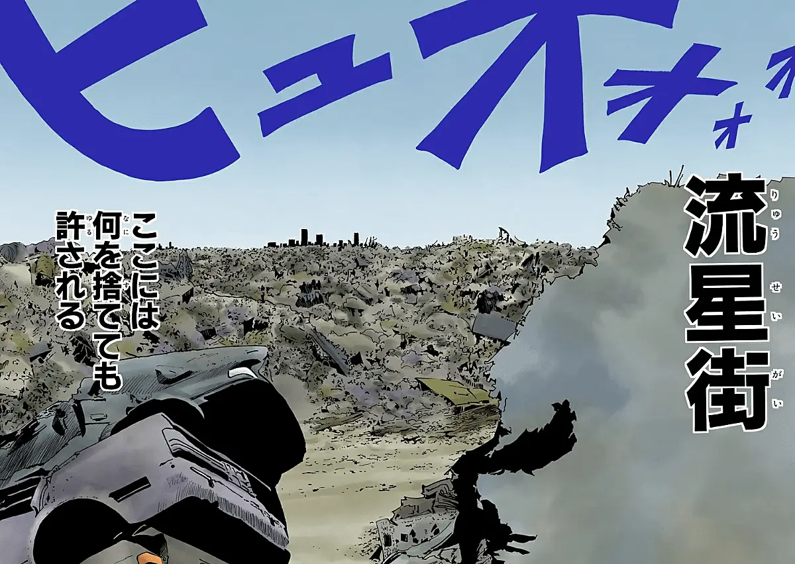
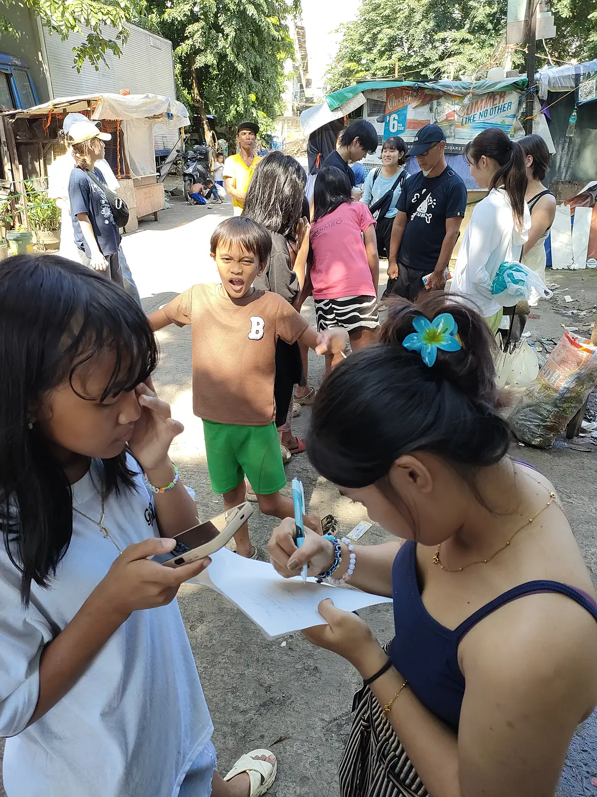
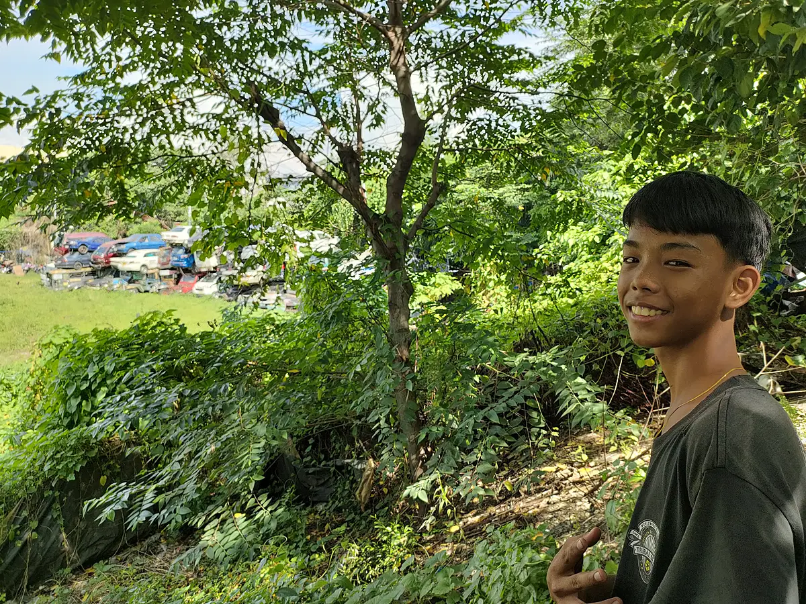
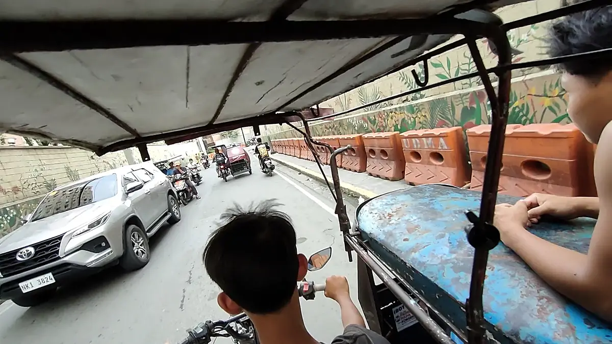

フィリピン・マニラについた私はチャッピー（ChatGPT）に尋ねた。「フィリピンになんか漫画のモチーフになったスポットある？」

世界広しと言えど、この一生でその全てを周り切ることは不可能。そう考えた私は、世界のどこかに行くならば、何か漫画のモチーフになった場所を目指そう、と企んでいた。特にONE PIECEにおいては、世界中のあらゆる場所がモデルとなって作中に登場しているようで、いつかそんな地を巡って楽しもう、そう思っていた。チャッピーは答えた。

「**スモーキーマウンテン（マニラ）**：ワンピースの「不確かな物の終着駅（グレイ・ターミナル）」、HUNTER×HUNTERの「流星街」のモデルとされています。」

<figure>
  
  <figcaption>グレイ・ターミナル -『ONE PIECE』©尾田栄一郎／集英社</figcaption>
</figure>

<figure>
  
  <figcaption>流星街 -『HUNTER×HUNTER』©冨樫義博／集英社</figcaption>
</figure>

マジか。まさにじゃねーか。そういうとこ行きたいのよ。ほんでマニラか。近けーな。行こう。
マニラについて数日経ち、落ち着いた日曜日、私はスモーキーマウンテンに向かった。

> 捨てられた大量のゴミの山は日光による自然発火でいつも煙を上げているーー

スモーキーマウンテンと呼ばれる由来のようだが、現在はゴミの山は撤去されているようだ。しかし元々ゴミ拾いで生計を立てていた住民が住み続けており、地域の雰囲気や人々の生活様式には「かつてのスモーキーマウンテン」の歴史が色濃く残っている、とのこと。

Grab タクシーで50分ほどかけて目的地付近に降ろされた私は、適当に歩いてそれっぽい場所に入って行った。

道ゆく私を人々は見つめる。私はにこやかに務めた。一人の痩せた親父が私に尋ねた。「Where you from?」「ジャパン。」私は答えた。すると親父は斜め上を指さして何か言った。あっちに進めってか？「あっちに進んだらええのん？サンキュー。」私は言った。しかし親父はまだ斜め上を指さして何か言っている。親父に顔を近づけ指さす方を見ると、丘の上から集団が降りて来ている。なるほど？さては日本人グループとジャリボーイの集団だな？私は進み、降りてきた集団の女性に尋ねた。

「Hi. Are you traveler?」「イェス。」
「Where you from?」「ジャパン。ウェアユーフロム？」
「Japan.」「オゥ。え、really？」
「Yeah. Konnichiwa. なんのグループですかこれ」

関西の大学のゼミのグループとのこと。肌の焼けたキャップの先生を含む、7人ほどのパーティーであった。「お菓子一緒に配ります？」「あ、じゃあ。はい。」私は彼らのお菓子配りイベントに参加した。「どうぞ。」「うっす。」渡されたお菓子を群がる少女らに渡していく。

「いくつ？」「いくつ？ってタガログ語でなんてーの？」「『こんにちは』はﾏｶﾞﾝﾀﾞﾝ･ﾊﾎﾟﾝよな、おはようてなんだっけか？」ガキんちょらと話してしばらくし、日焼けキャップが私に言った。「じゃあ、我々はこれで。」「あ、どうも。さいなら。」しばらくして私も前方に進み始めた。

少し歩くと少年が現れた。なんか見して回ってくれるっぽいのでついてった。私を自分の住処っぽいところに連れていく。「これ鳥食うん？」「食う。食うし戦う。」そこらを歩く鶏は食用でもあり闘鶏用でもあるらしい。「はい。ここ捨てられた車がいっぱい。」「おぉ。」次に私を丘に連れていく。「これ野菜。」「おぉ」「これ写真スポット。撮ってほしい？」「え？あ、うん。」パシャ。集落内を練り歩き、いろいろ見せてくれた。

<figure>
  
  <figcaption>少年</figcaption>
</figure>

「マガンダン・ハポン」時折そう言いながら歩いていると、少年は「マガンダン・ハポン、イヌーティリカ！」と教えてくれた。「マガンダン・ハポン。イヌーティリカ！」少年は笑った。集落のあちこちでそう言って回ると人々は笑い、少年も笑った。道ゆく親父が少年をこづく。あるおばちゃんは教えてくれた。「That's a bad word!」私は何やらバッドワードを教わったらしい。なんだろね。

「バスケコートレッツゴー。」「おぉ。レッツゴー。」ひらけた場所にバスケのゴールがあり、そこに少年らが集っている。「戦え。」「え？おぅ、わかった。」その場にいた青年と私の1on1が始まった。5点マッチだ。得点は2対2。あかん。キツすぎる。「3点マッチにしてくれ。OK?」私はひらりと青年をかわし、3点目を決めた。「Epi lepi move!!」ギャラリーが沸いている。「エピレピムーブ！」なんかわからんけど私がそういうと、ギャラリーはまた沸いた。

「腹減ってんだ、なんか食わして」少年は私に言った。「うーん、まぁ、ええよ。」私は言った。「ちょ、待ってて、友達呼んでくる。」友達を1人引き連れ、少年はサイドカー付きバイク（トライシクル？）で現れた。

「乗りな」私をバイクの後ろに乗せ、友達はサイドカーの後ろにしがみついた。（乗らんのや。）どこにいくか何やら話し終えると、一行は街を疾走し、Jollibee（ジョリビー）に到着した。町の至る所で見かける。フィリピンのナンバーワンチェーン店っぽい。ハンバーガー、パスタ、骨付きチキンなどが食べれる。

<figure>
  
  <figcaption>疾走</figcaption>
</figure>

「僕らここで待ってる。」スラムの子は店に入らないノリ？があるっぽい。警備に止められる？YouTubeで見たやつだ。「OK. 待ってろ。」私は店に入り、列に並んだ。混んでるな。前に並んだちびっ子が私を見てニヤついている。「ハロー。」私がいうと彼らもそう返した。

「らっしゃいませ。ご注文は？」「スパイシーチキンセット3つ。飲みもんはこれとこれとこれ。」52番の待機札を受け取った私は、長いこと並んでたので外にいる少年らに札を見せに行った。もうちょい待てよ、の意である。少年らはグッドで応じた。

商品を受け取った私はバイクへ戻った。「食ってく？帰って食う？」私は尋ねた。「帰って食う。寄り道さしてくれ。5分。水汲む。」少年は言った。クラクション飛び交う道を抜け、人の行き交う市場の裏、木陰の水汲み場に到着した。もう1組水を組むペアがいた。客か？店主か？わからない。腰に手を当て虚空を見つめる女。俯きながら水を汲む男。何かに絶望してるように見えなくもない。元々そういう顔だったらごめん。

「バスケットボール、エピレピムーブ！」少年は男に何か伝えた。「Yeah. I did エピレピムーブ！」私は少年に続いた。男女はニコリ笑った。「やる？水汲み。」少年は私に言った。「OK. Let me try.」割れたポリタンクに大きな瓶（カメ）から水を1度2度3度注ぎ、「Okay, you slow. 代わろう。」そう言われて少年と代わった。

赤子を抱えたヤンママがこちらに歩いてくる。「Hi.」反応はない。「マガンダン・ハポン。」反応はない。その顔は何か絶望してるようにも見えた。あれは多分ガチ絶望してる。赤子は目を見開いて私を見つめる。

バイクを前後させ向きを変え、一行は出発した。集落に戻った少年はジョリビーを抱え、バスケットコートへ向かった。え？そんな見せびらかすように食ってええのん？みんなの分ないぜ？そう思いながらついていくと、少年らが集まってきた。友達は遅れて米の大皿を持って現れた。抱えたドリンクを指差し、「くれ。くれ。」少年らにせっつかれる。「彼に聞いてくれ」私は答える。

「You, Japan?」少年の1人に聞かれる。「Yeah.」「なんか日本の歌歌ってよ」「Ok」米津玄師の「飛燕」のサビを歌った。最近ハマっている。「ドラゴンボールの歌歌える？」「Yeah, どれがええ?」「Cha-ra, hecchara,」「あーね。」私はドラゴンボールZのOPのサビを全力で歌った。ギャラリーは沸いた。「ドラえもん歌って」「どんなやっけ？」「ルルルー♪」よくわからんかったので知ってるやつ歌った。「シャララララ♪歌を歌おぉ♪」すまん、確か有名なのこれじゃないよな。書きながら思い出したけど「はい、タケコプター♪」やな、有名なやつ。ちょっとそこ以外今も思い出せん。

少年は何やら言い出した。少年らは笑っている。ペニスがどうの、股間で手を上下させている。あぁ、なるほどな。「Yeah, エピレピムーブ。」そういうとギャラリーは沸いた。「Youは純粋な日本人?」私は聞かれた。「Yeah, 父ちゃん日本人、母ちゃん日本人、エピレピムーブ、俺。」ウケた。

「ゲームセンター行く？クーラーあって涼しいぜ！」少年は言った。「今日はもう帰るわ。バスケして疲れた。」私は言った。少年はバイクに乗り、友達はサイドカーに捕まり、集落の入り口まで私を送っていった。道中、バイクを止めては歌えと言われるので集落の人々にドラゴンボールを歌って回った。

集落の入り口、Grabタクシーの予約をする。「ヘイ、友情の証だ、それをくれ。」私は両の腕にたくさんつけたヘアゴムを1つずつ、少年たちに授けた。「いつ戻ってくる？」「知るか。気長に待て。」私は言った。

「Grab着いたみたいだ。ちょいずれてんな。あっちの方。じゃあ俺は行くぜ。またな。」そう言って少し歩くと、少年らは後ろからトライシクルで追いかけて来た。それに乗り込み、車を探した。「NZA 5228... あれだ！」目的の車を見つけ、トライシクルを降り、少年たちに手を振りながらタクシーに乗り込んだ。あばよ少年。楽しかったぜ。

車のドライバーと話しながら、私は次の宿へと向かった。

