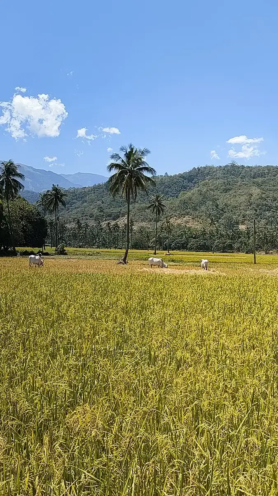

# 桑記 28巻4章「暮らしを見つめて」
2026年4月

🌴 ミンドロ島探訪
🏯 川越宿滞在
🚗 免許更新
🛠️ 母DIY手伝い
🦌 西条シカ猟見学

## 検索履歴
訪問サイト数：1111件（YouTube：134件）

2026年4月は、フィリピンから日本へ戻る移動と、その後の国内移動・滞在先探しを起点にしながら、地理学習、韓国語、音声AIエージェント開発、Kuwasidian のクエスト運用が並行して進んだ月だった。前月までのフィリピン文脈は、航空券・空港・港湾・地図の検索として現実の移動に収束し、帰国後は松山、川越、成田周辺など日本国内の場所調べへ重心が移っている。一方で、技術面では `LiveKit`、`Kilo Code`、`agent-browser`、`DeepWiki`、音声入力・音声エージェントまわりの調査が濃く、実装や運用に直結する探索が続いていた。学習面では高校地理の体系的な復習と韓国語入門が目立ち、娯楽では YouTube、バラエティ、音楽、鍼灸動画などが雑多に流れ込んでいる。

### 🌏 移動・帰国・国内滞在の下調べ
4月前半は、マニラから東京・松山への航空券、空港への経路、ORAS、Jetstar、Skyscanner、Kiwi.com、Booking.com などの検索が集中しており、フィリピン滞在から日本へ戻る実務的な移動準備が中心だった。帰国後は、成田空港から川越のゲストハウス、成田ゆめ牧場、森林公園、松山市、愛媛県運転免許センター、壬生川駅、道後周辺の Airbnb など、国内の移動先と宿泊先を細かく確認していた。Google マップの訪問数も多く、抽象的な旅行計画ではなく、実際の移動経路、滞在場所、生活動線を詰める月だったことがわかる。

  <a href="https://www.youtube.com/watch?v=dG4QNnVlmis" target="_blank" rel="noopener noreferrer">
    
    Tokyo's Map, Explained - YouTube
  </a>
  <a href="https://www.youtube.com/watch?v=mcqvMXtWglA" target="_blank" rel="noopener noreferrer">
    
    共産党一党支配の国、キューバへ！社会主義国ならではのトラブル発生｜手作業でつくるコイーバ葉巻工場｜ラム酒工場見学【ホリエモンの中南米旅】 - YouTube
  </a>
  <a href="https://www.youtube.com/watch?v=a-E_--0QJpU" target="_blank" rel="noopener noreferrer">
    
    自給自足の農地を探し回りました！役立つ地図サイトと調査のポイントを紹介。交渉の結果は‥‥^_^; - YouTube
  </a>
  <a href="https://www.youtube.com/watch?v=1QPMcWpJEgM" target="_blank" rel="noopener noreferrer">
    
    How Japan Finally Made It Impossible to Make Babies - YouTube
  </a>
  <a href="https://www.youtube.com/watch?v=qkueWXx1peg" target="_blank" rel="noopener noreferrer">
    
    【正直不動産】かまいたちが新生活の部屋探しの大事なポイントを正直に答える！ - YouTube
  </a>
  <a href="https://www.youtube.com/watch?v=gklPg4-o62A" target="_blank" rel="noopener noreferrer">
    
    【ひろゆき】※賃貸選びの基準はコレ※ これから引っ越しや一人暮らしを考えている人は聴いて - YouTube
  </a>
  <a href="https://www.youtube.com/watch?v=roJiyGkLBI4" target="_blank" rel="noopener noreferrer">
    
    【不動産実務の超重要ツール】レインズを知らないと仕事になりません…概要や使い方のコツを徹底解説！ - YouTube
  </a>
  <a href="https://www.youtube.com/watch?v=92XjMln4048" target="_blank" rel="noopener noreferrer">
    
    ITが発達しても住む場所と働く場所は自由に選べないという話：なぜ最もフルリモートが可能そうなIT産業が出社を要求するのか？ - YouTube
  </a>

### 🗾 地理学・気候・地形への潜航
今月もっともまとまった学習テーマは地理だった。高校地理の「地図」「地形」「気候」「農業」をシリーズで見直し、プレートテクトニクス、大地形、河川地形、海岸地形、氷河・カルスト・サンゴ礁、大気大循環、コリオリの力、農業分類まで順に追っていた。`earth :: a global map of wind, weather, and ocean conditions` やコリオリ関連動画も見ており、暗記科目としてではなく、地球の動きや人間の居住・農業・都市の成立をつなげて理解しようとしている。ボードゲーム `Oros` や、プレート・安定陸塊をテーマにしたパズルの検索もあり、学習内容を遊びや制作の題材に変換しようとする気配もあった。

  <a href="https://www.youtube.com/watch?v=bMvyfjI6J3A" target="_blank" rel="noopener noreferrer">
    
    【高校地理】1-1. 現代世界の地図 | 1.さまざまな地図と地理的技能 - YouTube
  </a>
  <a href="https://www.youtube.com/watch?v=l78awcSb3d0" target="_blank" rel="noopener noreferrer">
    
    【高校地理】2-2. 大地形と内的営力（プレートテクトニクス） | 2.世界の地形 - YouTube
  </a>
  <a href="https://www.youtube.com/watch?v=adk31rzqE1E" target="_blank" rel="noopener noreferrer">
    
    【高校地理】2-7. 河川がつくる小地形（扇状地、氾濫原、三角州） | 2. 世界の地形 - YouTube
  </a>
  <a href="https://www.youtube.com/watch?v=cWD7qcq0NNc" target="_blank" rel="noopener noreferrer">
    
    【高校地理】3-1. 気候要素と気候因子、世界の気温 | 3. 世界の気候 - YouTube
  </a>
  <a href="https://www.youtube.com/watch?v=ALGn7mNynZo" target="_blank" rel="noopener noreferrer">
    
    【高校地理】3-2. 大気大循環（雨季と乾季の生じるしくみ） | 3. 世界の気候 - YouTube
  </a>
  <a href="https://www.youtube.com/watch?v=6L5UD240mCQ" target="_blank" rel="noopener noreferrer">
    
    The Coriolis Effect - YouTube
  </a>
  <a href="https://www.youtube.com/watch?v=ao_-OjDQwfk" target="_blank" rel="noopener noreferrer">
    
    Where Does Wind Come From? Crash Course Geography #8 - YouTube
  </a>
  <a href="https://www.youtube.com/watch?v=xa6SdvFA3w0" target="_blank" rel="noopener noreferrer">
    
    How Do Oceans Circulate? Crash Course Geography #9 - YouTube
  </a>
  <a href="https://www.youtube.com/watch?v=ktckyIzF9UQ" target="_blank" rel="noopener noreferrer">
    
    【高校地理】5-1. 農業の成立条件と起源 | 5. 世界の農林水産業 - YouTube
  </a>
  <a href="https://www.youtube.com/watch?v=SzCfsh4bRS8" target="_blank" rel="noopener noreferrer">
    
    Oros | Rahdo's Prototype Thoughts - YouTube
  </a>
  <a href="https://www.youtube.com/watch?v=49JwbrXcPjc" target="_blank" rel="noopener noreferrer">
    
    Visualization of the Coriolis and centrifugal forces - YouTube
  </a>
  <a href="https://www.youtube.com/watch?v=ubEbmj9jpDA" target="_blank" rel="noopener noreferrer">
    
    ゆっくり解説　なぜ赤道では絶対に台風は発生しないのか？ - YouTube
  </a>
  <a href="https://www.youtube.com/watch?v=Ye45DGkqUkE" target="_blank" rel="noopener noreferrer">
    
    Global Atmospheric Circulation - YouTube
  </a>
  <a href="https://www.youtube.com/watch?v=PFxpJkMXhwg" target="_blank" rel="noopener noreferrer">
    
    Understanding Global Atmospheric Circulation - YouTube
  </a>
  <a href="https://www.youtube.com/watch?v=ZtSdxPMlnYI" target="_blank" rel="noopener noreferrer">
    
    【高校地理】2-11. 日本の地形、地震・火山 | 2. 世界の地形 - YouTube
  </a>
  <a href="https://www.youtube.com/watch?v=b1iNMhpH6WI" target="_blank" rel="noopener noreferrer">
    
    【高校地理】2-10. 氷河地形、カルスト地形、サンゴ礁 | 2. 世界の地形 - YouTube
  </a>
  <a href="https://www.youtube.com/watch?v=DRjGwA2rq9E" target="_blank" rel="noopener noreferrer">
    
    【高校地理】2-9. 海岸の小地形（リアス海岸、フィヨルドなど） | 2. 世界の地形 - YouTube
  </a>
  <a href="https://www.youtube.com/watch?v=ECUwTWCNQNs" target="_blank" rel="noopener noreferrer">
    
    【高校地理】2-8. 河岸段丘と台地 （洪積台地） | 2. 世界の地形 - YouTube
  </a>
  <a href="https://www.youtube.com/watch?v=qQS7CFUOO0E" target="_blank" rel="noopener noreferrer">
    
    【高校地理】2-6. 大地形の区分（3）（安定陸塊） | 2. 世界の地形 - YouTube
  </a>
  <a href="https://www.youtube.com/watch?v=g7koyzaHcQ4" target="_blank" rel="noopener noreferrer">
    
    【高校地理】2-5. 大地形の区分（2）（古期造山帯） | 2.世界の地形 - YouTube
  </a>

### 🤖 音声AI・エージェント開発の継続調査
技術調査では、音声エージェントとブラウザ・デスクトップ操作の関心が強かった。`LiveKit` のドキュメント、Agent Console、Agents Playground、Voice AI quickstart、Cartesia TTS、`AlphaAvatar`、`local-voice-ai`、`Conversify`、`openinterpreter/01`、`VoiceMode for Claude Code` などを見ており、音声入力、音声会話、リアルタイム会話エージェント、ローカルAI、ブラウザ操作を組み合わせる方向の探索が続いている。`agent-browser` や `Kilo Code`、`DeepWiki`、`MCP` 関連も多く、単にツールを眺めるというより、Kuwasidian や自分の作業環境にどう組み込むかを検討していた月に見える。Revit MCP や Autodesk AI Assistant も見ており、建築ソフト拡張案件の後処理的な技術関心も残っていた。

  <a href="https://www.youtube.com/watch?v=Biva5VGV5Pg" target="_blank" rel="noopener noreferrer">
    
    Conversify: Real-Time Voice &amp; Vision AI Assistant Demo - YouTube
  </a>
  <a href="https://www.youtube.com/watch?v=cYdwOD_-dQc" target="_blank" rel="noopener noreferrer">
    
    VoiceMode for Claude Code: Conversational Coding - YouTube
  </a>
  <a href="https://www.youtube.com/watch?v=EcuCyY4hoIg" target="_blank" rel="noopener noreferrer">
    
    Make OpenClaw Talk for FREE (No API Needed) - YouTube
  </a>
  <a href="https://www.youtube.com/watch?v=MZLzvN3vmtI" target="_blank" rel="noopener noreferrer">
    
    Omi Launch Video - YouTube
  </a>
  <a href="https://www.youtube.com/watch?v=rEUXpnVQF9w" target="_blank" rel="noopener noreferrer">
    
    How to Fully Control Your Mac Using Only Your Voice! - YouTube
  </a>
  <a href="https://www.youtube.com/watch?v=jeA-KBv0b68" target="_blank" rel="noopener noreferrer">
    
    Claude just got another superpower... - YouTube
  </a>
  <a href="https://www.youtube.com/watch?v=Neb7g5xPfFk" target="_blank" rel="noopener noreferrer">
    
    New in Revit 2027 - Revit MCP Server + Claude - YouTube
  </a>
  <a href="https://www.youtube.com/watch?v=1nhwdiAVDYo" target="_blank" rel="noopener noreferrer">
    
    New in Revit 2027: Autodesk AI Assistant - YouTube
  </a>
  <a href="https://www.youtube.com/watch?v=ZJBef2fy7kU" target="_blank" rel="noopener noreferrer">
    
    Apple Intelligence How To Type to Siri macOS 15 - YouTube
  </a>
  <a href="https://www.youtube.com/watch?v=o7NYXvYohYk" target="_blank" rel="noopener noreferrer">
    
    Millions of JS devs just got penetrated by a RAT… - YouTube
  </a>
  <a href="https://www.youtube.com/watch?v=MV6TuU7HBdc" target="_blank" rel="noopener noreferrer">
    
    How To Bring Back the Old Launchpad in macOS 26 Tahoe! - YouTube
  </a>

### 🧭 Kuwasidian・クエスト運用・制作環境
自分のサイトとクエスト周辺の閲覧も多かった。`Kuwasidian Quests`、`学徒の遺産`、`手記の行く末`、`甲虫王者は何処`、`若者の素顔`、`地球にDIVE IN` などのページを何度も確認しており、月報やクエスト形式の運用を調整していたことがうかがえる。`localhost:5173`、`localhost:8082/prompt`、VitePress、Obsidian CLI、GitHub の README アンカー問題、shadcn/vue や Reka UI なども見ており、サイト生成、UI、プロンプト、ローカル開発環境の細部を詰めていた。検索履歴上では、日々の生活や学習の記録を「クエスト」として編集し直す作業が、技術調査と同じくらい重要な活動として現れている。

### 🇰🇷 韓国語・歌・言語感覚の入口
語学では韓国語が一気に増えた。ハングルの読み方、カナダラソング、`Easy Korean` の街頭インタビュー、韓国語発音の疑問、自己紹介フレーズ、年齢表現、韓国バーベキュー、旅行先、ソウルのロッククライミングや野球観戦など、初歩から生活文脈まで広く見ていた。10cm の「ストーカー」も日本語訳、コード、カバー動画をまたいで追っており、語学学習と音楽の耳コピ・歌詞理解がつながっている。3月の日本語・異文化関心が、4月には韓国語という具体的な学習対象へ移った形だった。

  <a href="https://www.youtube.com/watch?v=8Za8QZCQQ4k" target="_blank" rel="noopener noreferrer">
    
    1分30秒でハングルが読めるようになる神動画 - YouTube
  </a>
  <a href="https://www.youtube.com/watch?v=J5fv2Ei6L9g" target="_blank" rel="noopener noreferrer">
    
    1番簡単で覚えやすいカナダラソング(ハングルソング) 가나다라 한글송 韓国語の文字の覚え方 - YouTube
  </a>
  <a href="https://www.youtube.com/watch?v=ZnEoJXGdLMM" target="_blank" rel="noopener noreferrer">
    
    Easy Korean 1 - The Olympic Park in Seoul - YouTube
  </a>
  <a href="https://www.youtube.com/watch?v=KRuPxQ2KPts" target="_blank" rel="noopener noreferrer">
    
    Easy Korean 3 - Gangnam - YouTube
  </a>
  <a href="https://www.youtube.com/watch?v=fsKPdvFAs_c" target="_blank" rel="noopener noreferrer">
    
    Easy Korean 7 - Travel destinations - YouTube
  </a>
  <a href="https://www.youtube.com/watch?v=zTldGa24mvk" target="_blank" rel="noopener noreferrer">
    
    10 phrases to introduce yourself in Korean | Easy Korean 10 - YouTube
  </a>
  <a href="https://www.youtube.com/watch?v=mu6TfeVN7yw" target="_blank" rel="noopener noreferrer">
    
    Why does 네 sound like [de], not [ne]? | Korean Pronunciation - YouTube
  </a>
  <a href="https://www.youtube.com/watch?v=lVIFnbTwWPs" target="_blank" rel="noopener noreferrer">
    
    ストーカー - 10cm 日本語訳（ルビ付） - YouTube
  </a>
  <a href="https://www.youtube.com/watch?v=5VkI5pMKl7I" target="_blank" rel="noopener noreferrer">
    
    Rock climbing in Seoul | Easy Korean 13 - YouTube
  </a>
  <a href="https://www.youtube.com/watch?v=0OEvuXnKvR4" target="_blank" rel="noopener noreferrer">
    
    A Baseball Match in South Korea | Easy Korean 12 - YouTube
  </a>
  <a href="https://www.youtube.com/watch?v=a_DMz8O5ynI" target="_blank" rel="noopener noreferrer">
    
    Easy Korean 2 - Summer - YouTube
  </a>
  <a href="https://www.youtube.com/watch?v=TVTEsh1QAok" target="_blank" rel="noopener noreferrer">
    
    Korean Barbeque | Easy Korean 16 - YouTube
  </a>
  <a href="https://www.youtube.com/watch?v=6VTsafbqMGk" target="_blank" rel="noopener noreferrer">
    
    Free time | Easy Korean 8 - YouTube
  </a>
  <a href="https://www.youtube.com/watch?v=Vkd1hBztDzs" target="_blank" rel="noopener noreferrer">
    
    At the beach | Super Easy Korean 1 - YouTube
  </a>
  <a href="https://www.youtube.com/watch?v=9FKabmW-B3I" target="_blank" rel="noopener noreferrer">
    
    Why are Koreans always older than others? | Easy Korean 13 - YouTube
  </a>
  <a href="https://www.youtube.com/watch?v=R0SlwJ0QfGI" target="_blank" rel="noopener noreferrer">
    
    チャウヌcover/ストーカー（스토커) 10cm【日本語字幕/和訳】 - YouTube
  </a>
  <a href="https://www.youtube.com/watch?v=XCueiBZ-gVc" target="_blank" rel="noopener noreferrer">
    
    LE SSERAFIM - 스토커 [더 시즌즈-10CM의 쓰담쓰담] | KBS 251114 방송 - YouTube
  </a>

### 😂 娯楽・身体メンテナンスの回遊
娯楽では YouTube が引き続き最大勢力で、ヒカル、ホリエモン、バキ童、かまいたち、街の賢者、ワンピース考察、ABEMA 系の短尺、Japanese Twitter、社会解説、心理・脳科学系の要約などを広く見ていた。Kindle Unlimited の登録導線も見られる。身体面では鍼灸院、鍼治療、毛穴洗浄、耳掃除、お灸、坐骨神経痛などの動画・予約ページが多く、移動後の疲労や身体のケアに意識が向いていた。Amazon では充電器、スマホケース、蟹、習字セットなど生活用品の検索があり、旅の荷物整理と日本での生活再構築が混ざった月でもあった。

  <a href="https://www.youtube.com/watch?v=SqaBTlGg8hs" target="_blank" rel="noopener noreferrer">
    
    ビジネス系YouTubeって何！？怖くて出演を断っていたバキ童に教える - YouTube
  </a>
  <a href="https://www.youtube.com/watch?v=gJ3XPYo6NWg" target="_blank" rel="noopener noreferrer">
    
    ヒカキンさんが麦茶を出すらしい！先にCMの内容を予想して当てちゃおうぜ！！！【ONICHA】【CM極秘最速入手】【お久しぶりです】 - YouTube
  </a>
  <a href="https://www.youtube.com/watch?v=u0CE5HROPpA" target="_blank" rel="noopener noreferrer">
    
    【バ化学】知識0から『蒸気機関』を完成させてやる！！！1m進んだらクリア！！！ - YouTube
  </a>
  <a href="https://www.youtube.com/watch?v=xkHjxw2xNK8" target="_blank" rel="noopener noreferrer">
    
    【ワンピースネタバレ】マジで分かっちゃいました。347 - YouTube
  </a>
  <a href="https://www.youtube.com/watch?v=ybd9kekAfQA" target="_blank" rel="noopener noreferrer">
    
    【耳掃除】かまいたち山内が初めてプロの耳掃除体験！※閲覧注意 - YouTube
  </a>
  <a href="https://www.youtube.com/watch?v=rOCZkmt4tsU" target="_blank" rel="noopener noreferrer">
    
    【顔面お灸】かまいたちが日頃の疲れを癒やす為にお灸を据えてもらった - YouTube
  </a>
  <a href="https://www.youtube.com/watch?v=HOeX-mQhE1Y" target="_blank" rel="noopener noreferrer">
    
    「骨がズレている…」9cm鍼で深部まで刺激した結果｜首・肩・腰の不調【鍼灸】 - YouTube
  </a>
  <a href="https://www.youtube.com/watch?v=j-UsFryaQq0" target="_blank" rel="noopener noreferrer">
    
    Japanese Twitter is incredible - YouTube
  </a>
  <a href="https://www.youtube.com/watch?v=qI9KFmDEPEg" target="_blank" rel="noopener noreferrer">
    
    【予告編】ヒカル×河村真木子、新番組ついに始動｜4月29日（水）19時配信 - YouTube
  </a>
  <a href="https://www.youtube.com/watch?v=CL0g9LEeqm0" target="_blank" rel="noopener noreferrer">
    
    元嫁ノアと再会しました - YouTube
  </a>
  <a href="https://www.youtube.com/watch?v=Q-YYTBOblJM" target="_blank" rel="noopener noreferrer">
    
    【大喧嘩】風吹ケイ激怒!?青木マッチョだと思ったら別のマッチョが来るドッキリ - YouTube
  </a>
  <a href="https://www.youtube.com/watch?v=3Oo6NkAF3aQ" target="_blank" rel="noopener noreferrer">
    
    そのへんを流れてる水の｢この冬一番冷たい瞬間｣を記録したい！ - YouTube
  </a>
  <a href="https://www.youtube.com/watch?v=l5CAX1zpRdI" target="_blank" rel="noopener noreferrer">
    
    ｢ほろ酔いで行った旅行｣を別の仲間ともう一度再現しよう！ - YouTube
  </a>
  <a href="https://www.youtube.com/watch?v=V5qzDYYjefU" target="_blank" rel="noopener noreferrer">
    
    むいむいが日本語の“最終ボス”すぎた（マットも驚いた日本語力） - YouTube
  </a>
  <a href="https://www.youtube.com/watch?v=cQR1Nd-h13Y" target="_blank" rel="noopener noreferrer">
    
    アメリカ人が日本のコメディを理解しようとして気づいたこと - YouTube
  </a>
  <a href="https://www.youtube.com/watch?v=HMin8pDtoN0" target="_blank" rel="noopener noreferrer">
    
    街の賢者　2017年9-10月まとめ - YouTube
  </a>
  <a href="https://www.youtube.com/watch?v=nrCdXcjwtD4" target="_blank" rel="noopener noreferrer">
    
    【樹木希林】ただの人見知りじゃない。集団で話さなくなる人の正体5選 - YouTube
  </a>
  <a href="https://www.youtube.com/watch?v=fAMsNuCiqOo" target="_blank" rel="noopener noreferrer">
    
    ガチ初対面のホリエモンと和牛ステーキと野菜食わせて無法地帯のホリエモンAI動画にキレてるかと嫌いな有名人＆サナエトークンについて暴露させたら最高月収数十億円だったw - YouTube
  </a>
  <a href="https://www.youtube.com/watch?v=xlAt7eZUPZc" target="_blank" rel="noopener noreferrer">
    
    【因縁】ヒカルとドラゴン細井を会わせてみたら、各方面への暴言＆暴露が止まらない凶悪コンビが誕生してしまった… - YouTube
  </a>
  <a href="https://www.youtube.com/watch?v=zS_afvsKdKY" target="_blank" rel="noopener noreferrer">
    
    【毛穴洗浄】かまいたち濱家が初めて毛穴洗浄エクストラクションを体験！ - YouTube
  </a>

## その他
- `openai/gpt-5.5` で生成

