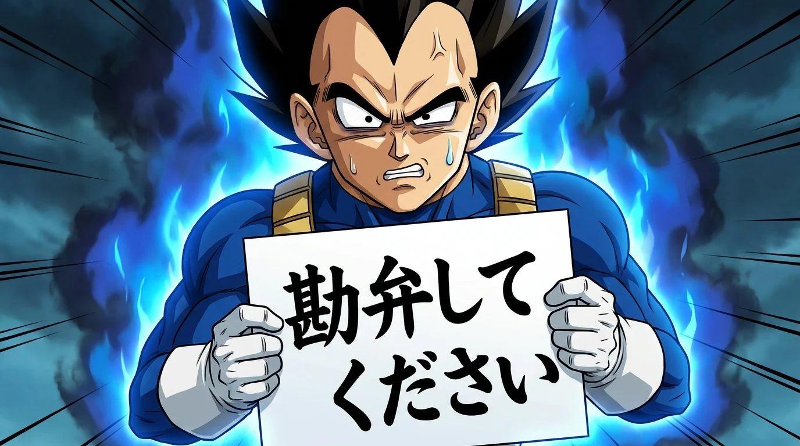

# 桑記 28巻5章「逆襲のR」
2026年5月

🎙️ VoiVoi（パソコン音声操作アシスタント）開発
🚚 Git Van（システム開発の建築アニメーション化）開発
🥤 コンビニ店内調合カフェドリンク購入

## ピックアップ

  <a href="https://www.youtube.com/watch?v=UONNrEtJzM8" target="_blank" rel="noopener noreferrer">
    
    【地理】四国の高低差・凸凹な土地を空から見る - YouTube
  </a>

四国の各県の地理的特徴を解説する動画。メサ、ビュートって地理で習ったけど香川にもあったのか。。！

## 検索履歴
訪問サイト数：1903件（YouTube：146件）

5月は芸人動画の視聴が引き続き活発で、特にダウンタウンプラスやチャンスの時間の切り抜き動画を多数視聴。R藤本（ベジータ）関連のDB芸人コンテンツに深く掘り下げた。開発面ではElectronアプリのセットアップ、shadcn/uiの導入、LiveKitを用いた音声エージェントの実装、React Router v7のSSR構成を調査。React RouterとBun、Honoの組み合わせやPreact Signalsとの統合も検討。松山市周辺の不動産物件検索に加え、新しい賃貸検索アプリ（Comfy）もチェック。多言語話者とのやり取りや言語ドッキリ動画への関心が高かった。愛媛県・中島の観光や農業、畜産に関する調査も実施。語学学習としてEasy Koreanシリーズ、Pimsleurを確認。歴史的・地理的な教養動画（空海、中央構造線、四国の地形、古代文明など）への関心も持続。Gitリポジトリの3D可視化ツール（git-truck、CodeCharta）の調査や、AnkiのMCP/CLIツールの確認も。

### 🎭 お笑い・芸人動画
ダウンタウンプラス、チャンスの時間（ABEMA）、IPPONグランプリなどの大喜利・トーク番組の切り抜き動画を幅広く視聴。特にR藤本（ベジータ）のDB芸人関連コンテンツに深く掘り下げ、「DB芸人没落の歴史」シリーズや各種ランキング動画、鬼越トマホークとのコラボなどを多数視聴。永野のブチギレシリーズ、松本人志関連の動画も継続して視聴。空気階段の単独公演動画や、アイデンティティ、モグライダー、ランジャタイ、ハリウッドザコシショウなど、幅広く芸人動画を視聴。サンドウィッチリートル（サンドリ）の有吉ラジオ切り抜き（サンデーナイトドリーマー）も多数視聴。藤子不二雄A作品（笑ゥせぇるすまん、箱舟はいっぱい、ひっとらぁ叔父サンなど）のショートアニメも視聴。

  <a href="https://www.youtube.com/watch?v=dIKMMvqDKM0" target="_blank" rel="noopener noreferrer">
    
    【期間限定】あの日。松本人志 裏側完全ドキュメント - YouTube
  </a>
  <a href="https://www.youtube.com/watch?v=vaHhmR6IRFs" target="_blank" rel="noopener noreferrer">
    
    【期間限定】7:3トーク 伊集院光編 - YouTube
  </a>
  <a href="https://www.youtube.com/watch?v=1BO9RHB2FJk" target="_blank" rel="noopener noreferrer">
    
    【第9回単独公演】空気階段「銀次郎24」 - YouTube
  </a>
  <a href="https://www.youtube.com/watch?v=rZG42p-b5f0" target="_blank" rel="noopener noreferrer">
    
    【第9回単独公演】空気階段「舟」 - YouTube
  </a>
  <a href="https://www.youtube.com/watch?v=zStjEExXPbE" target="_blank" rel="noopener noreferrer">
    
    我を捨て生きる４４歳キャラ芸人の生きざま - YouTube
  </a>
  <a href="https://www.youtube.com/watch?v=d1KfpdBP2Vo" target="_blank" rel="noopener noreferrer">
    
    【そして崩壊へ…】DB芸人没落の歴史【R藤本】 - YouTube
  </a>
  <a href="https://www.youtube.com/watch?v=HJFtvFEOVFw" target="_blank" rel="noopener noreferrer">
    
    「DB芸人没落の歴史」から1年…DB芸人たちは今？ - YouTube
  </a>
  <a href="https://www.youtube.com/watch?v=4VupjFZM4iA" target="_blank" rel="noopener noreferrer">
    
    なぜベジータに？R藤本の素性を深掘り - YouTube
  </a>
  <a href="https://www.youtube.com/watch?v=adTfbn2c5EU" target="_blank" rel="noopener noreferrer">
    
    【ドッキリ】DB芸人R藤本に抜き打ちベジータクイズ - YouTube
  </a>
  <a href="https://www.youtube.com/watch?v=Z8nqLSxju4A" target="_blank" rel="noopener noreferrer">
    
    【R藤本】キャラ芸人のくせにプライドが高い芸人ランキング - YouTube
  </a>
  <a href="https://www.youtube.com/watch?v=Nq6mOh4kE9w" target="_blank" rel="noopener noreferrer">
    
    【天才】ピース又吉直樹という天才を生んだルーツ - YouTube
  </a>
  <a href="https://www.youtube.com/watch?v=PIqGqkIiJUY" target="_blank" rel="noopener noreferrer">
    
    何も知らないカジサックが泊まりに来て - YouTube
  </a>
  <a href="https://www.youtube.com/watch?v=XOMj_xOHN7c" target="_blank" rel="noopener noreferrer">
    
    サンドリ【日記】詰め合わせ - YouTube
  </a>
  <a href="https://www.youtube.com/watch?v=cVXf-dbUhUs" target="_blank" rel="noopener noreferrer">
    
    タモリ論争にブチギレた落語家の立川志らくが家にきました - YouTube
  </a>
  <a href="https://www.youtube.com/watch?v=6LRHAGUebK4" target="_blank" rel="noopener noreferrer">
    
    【永野＆くるま】芸人はなぜキングコング西野に生き延び方を聞いてこないのか？ - YouTube
  </a>
  <a href="https://www.youtube.com/watch?v=akFbfPsLEUw" target="_blank" rel="noopener noreferrer">
    
    『ホームで一言』から生まれた迷場面たち - YouTube
  </a>
  <a href="https://www.youtube.com/watch?v=d7hq_B7Bi7E" target="_blank" rel="noopener noreferrer">
    
    飯田の会社が赤字倒産しました - YouTube
  </a>
  <a href="https://www.youtube.com/watch?v=Uys1L3s2I0E" target="_blank" rel="noopener noreferrer">
    
    ラップみたいなお経にトラック付けたらめっちゃいい - YouTube
  </a>
  <a href="https://www.youtube.com/watch?v=zxVoCw3P1Gc" target="_blank" rel="noopener noreferrer">
    
    Once You Learn Economics, You Can't Be MANIPULATED Anymore - YouTube
  </a>
  <a href="https://www.youtube.com/watch?v=HE0TOjoN2cI" target="_blank" rel="noopener noreferrer">
    
    コバエはどこからやってくる？専門家に聞くと… - YouTube
  </a>
  <a href="https://www.youtube.com/watch?v=6n_jj0Lrmb8" target="_blank" rel="noopener noreferrer">
    
    【クリエイター対談】又吉と西野が語る「ダメ人間」と「正しい人」 - YouTube
  </a>
  <a href="https://www.youtube.com/watch?v=JFWZfqvnon0" target="_blank" rel="noopener noreferrer">
    
    炎上する人しない人・クリエイターは小学生の時に決まる - YouTube
  </a>
  <a href="https://www.youtube.com/watch?v=0gauySIc-Fc" target="_blank" rel="noopener noreferrer">
    
    R藤本くんの戦闘服着てみた【Wベジータ奇跡のコラボ】 - YouTube
  </a>
  <a href="https://www.youtube.com/watch?v=FfT79EOPP8g" target="_blank" rel="noopener noreferrer">
    
    やっぱり関わりたくないDB芸人ランキング【R藤本】 - YouTube
  </a>
  <a href="https://www.youtube.com/watch?v=Fgd1O0RPMd4" target="_blank" rel="noopener noreferrer">
    
    【DB芸人】は、何と検索されているのか？【R藤本】 - YouTube
  </a>
  <a href="https://www.youtube.com/watch?v=zlJEbrm6mu8" target="_blank" rel="noopener noreferrer">
    
    【男の夢】本当にドラゴンボール７つ集めてみた！！！ - YouTube
  </a>
  <a href="https://www.youtube.com/watch?v=rVCwQLmt0L4" target="_blank" rel="noopener noreferrer">
    
    ラランドはDB芸人を知っているのか？ - YouTube
  </a>
  <a href="https://www.youtube.com/watch?v=gthHBiEBzBo" target="_blank" rel="noopener noreferrer">
    
    【期間限定】みんなのオトナな話 - YouTube
  </a>

### 💻 開発・プログラミング
Electronアプリのセットアップと構成調査に注力。electron-viteによる開発環境構築、shadcn/uiのElectronへの導入方法（electron-shadcnテンプレート）、HMR/ホットリローディングの設定を調査。トレイアイコンの画質設定、window-all-closed設定、アセット/依存処理の確認も。LiveKitを用いた音声エージェントの実装を進め、push-to-talk機能、マイク制御、CLI認証、料金体系などを調査。ReactのflushSync、Dialogコンポーネントの制御（aria-describedby警告）、position: stickyのボーダー修正など、UI関連の技術調査も実施。iconify、itty-fetcher、tinykeysなどのライブラリ調査。agent-desktopのGitHubリポジトリを確認。キーボード・マウス入力制御ライブラリ（iohook、rdev、uiohook-napi、keyspy）の比較調査。VSCodeの設定（snippetサジェスト、プロジェクトパス取得、Copilot issue）も確認。

  <a href="https://www.youtube.com/watch?v=deg8bOoziaE" target="_blank" rel="noopener noreferrer">
    
    このビデオはコードを使って作成されました - YouTube
  </a>
  <a href="https://www.youtube.com/watch?v=ddFI63dgpaI" target="_blank" rel="noopener noreferrer">
    
    Talon Voice - Python Demo - YouTube
  </a>
  <a href="https://www.youtube.com/watch?v=VMNsU7rrjRI" target="_blank" rel="noopener noreferrer">
    
    Talon Eye Tracking - Zoom Mouse - YouTube
  </a>
  <a href="https://www.youtube.com/watch?v=JfPWbttemYE" target="_blank" rel="noopener noreferrer">
    
    The forgotten developer who saved JavaScript... - YouTube
  </a>
  <a href="https://www.youtube.com/watch?v=RjfbvDXpFls" target="_blank" rel="noopener noreferrer">
    
    Building pi in a World of Slop — Mario Zechner - YouTube
  </a>
  <a href="https://www.youtube.com/watch?v=gwTQLZSIlsU" target="_blank" rel="noopener noreferrer">
    
    A worm just ate its way through the NPM registry... - YouTube
  </a>
  <a href="https://www.youtube.com/watch?v=vjpTmkDgISE" target="_blank" rel="noopener noreferrer">
    
    Talon Voice - Multiple Language Support - YouTube
  </a>
  <a href="https://www.youtube.com/watch?v=BG4gouclXCw" target="_blank" rel="noopener noreferrer">
    
    Grok Desktop App Installation - YouTube
  </a>

### ⚛️ React Router v7・Preact Signals
React Router v7（旧Remix）のセットアップとSSR構成を重点的に調査。Bunサーバーとの組み合わせ（react-router-bun-hono-template）、Honoとの統合（react-router-hono-server）、Cloudflare Workersへのデプロイ構成を確認。useRef/useMemoの違い、useNavigate参照変化、redirect/linkの使い分け、Route Module Type Safetyなどを調査。Preact Signals（@preact/signals）との統合方法も検討。signals-agent-vite、signals-react-routerの互換性、useSignalEffectのmount時動作を確認。zustandとの比較も。

### 🏙️ Git可視化・コードメトリクス
git-truckの3Dビジュアライゼーション機能を調査。r3fブランチの3D表示、Git Skyline、CodeCityメタファーに関連するツール（CodeCharta、JSCity、City Blocks）を確認。Gourceやgit commit historyのアニメーション化（git tree animation）も調査。GitHubリポジトリを3D都市として可視化するgit-cityもチェック。

### 🌐 多言語・言語ドッキリ
多言語話者による言語ドッキリ・言語交換の動画に高い関心。「突然外国語を話した時のリアクション」「初対面で母国語を話しかけたら」「日本人がウクライナ語を話したら」「双子の海外の方に2段階言語ドッキリ」「世界最難関の2言語を話す人に言語ドッキリ」など、言語を切り替えて相手の反応を見るコンテンツを多数視聴。ロシア、アフリカ、中国、台湾、韓国など、様々な言語・地域の動画に触れた。

  <a href="https://www.youtube.com/watch?v=k26u6hosmoA" target="_blank" rel="noopener noreferrer">
    
    【80歳で20ヶ国語】なぜ日本人は英語を話せない？ - YouTube
  </a>
  <a href="https://www.youtube.com/watch?v=nyRf-9Sqkhc" target="_blank" rel="noopener noreferrer">
    
    超高学歴３人なら、初対面のイギリス人女性を英語の大喜利で爆笑させれる？ - YouTube
  </a>
  <a href="https://www.youtube.com/watch?v=jpWypU5ygt4" target="_blank" rel="noopener noreferrer">
    
    ザキヤマの英会話を見たニコラスニキの反応 - YouTube
  </a>

### 🌍 学習・教養（歴史・地理・経済）
歴史・地理関連の動画に広く関心。空海（弘法大師）関連のドキュメンタリーや解説動画を複数視聴。「神々の指紋」やギョベクリ・テペ遺跡といった古代文明・都市伝説系のコンテンツも視聴。中央構造線の断層や四国の高低差をGoogle Earthで確認する動画など、地理学的なコンテンツも。経済関連では成田悠輔の切り抜き動画（少子化問題、教育、業界選び、英語コンプレックス）を複数視聴。KDDIの粉飾事件を銀行員視点で解説した動画、Ray Dalioの世界秩序の変遷に関する動画なども視聴。イスラムの歴史を10分で解説する動画や、Easy Koreanによる韓国語学習シリーズも継続。高校地理（季節風、海流と気候）の学習動画も視聴。

  <a href="https://www.youtube.com/watch?v=EJ5b-pXdPME" target="_blank" rel="noopener noreferrer">
    
    異次元の天才・空海を徹底考察！ - YouTube
  </a>
  <a href="https://www.youtube.com/watch?v=_uHkhfmjc4M" target="_blank" rel="noopener noreferrer">
    
    異次元の天才・空海と又吉には衝撃的な共通点が！？ - YouTube
  </a>
  <a href="https://www.youtube.com/watch?v=jKUhkj-PJb0" target="_blank" rel="noopener noreferrer">
    
    空海物語 - YouTube
  </a>
  <a href="https://www.youtube.com/watch?v=ruqB4mUs06Y" target="_blank" rel="noopener noreferrer">
    
    人類史の不都合がついにバレる！？ギョベクリ・テペ遺跡の謎 - YouTube
  </a>
  <a href="https://www.youtube.com/watch?v=TJ5IT3EnY8o" target="_blank" rel="noopener noreferrer">
    
    中央構造線 を富士山の高さから マッハ2.6で見る - YouTube
  </a>
  <a href="https://www.youtube.com/watch?v=UONNrEtJzM8" target="_blank" rel="noopener noreferrer">
    
    【地理】四国の高低差・凸凹な土地を空から見る - YouTube
  </a>
  <a href="https://www.youtube.com/watch?v=w-V7jfFEI9I" target="_blank" rel="noopener noreferrer">
    
    【銀行員が解説】KDDI「粉飾倍々Fight！」 - YouTube
  </a>
  <a href="https://www.youtube.com/watch?v=xguam0TKMw8" target="_blank" rel="noopener noreferrer">
    
    Principles for Dealing with the Changing World Order by Ray Dalio - YouTube
  </a>
  <a href="https://www.youtube.com/watch?v=PDxKxnVZtgo" target="_blank" rel="noopener noreferrer">
    
    How Islam Began - In Ten Minutes - YouTube
  </a>
  <a href="https://www.youtube.com/watch?v=PBK46NKsEbQ" target="_blank" rel="noopener noreferrer">
    
    文明を捨て、自給自足の拠点を築く | オフグリッド・エンジニアリング - YouTube
  </a>
  <a href="https://www.youtube.com/watch?v=cEKGyzG_odw" target="_blank" rel="noopener noreferrer">
    
    年間300トン生産！植物工場急増の裏側 - YouTube
  </a>
  <a href="https://www.youtube.com/watch?v=u4TQR1nCktw" target="_blank" rel="noopener noreferrer">
    
    【高校地理】季節風（モンスーン）、局地風 - YouTube
  </a>
  <a href="https://www.youtube.com/watch?v=ruiYQLt8mtg" target="_blank" rel="noopener noreferrer">
    
    【高校地理】海流と気候 - YouTube
  </a>
  <a href="https://www.youtube.com/watch?v=kF6sKUazphI" target="_blank" rel="noopener noreferrer">
    
    Easy Korean 4 - The Island of Jejudo - YouTube
  </a>
  <a href="https://www.youtube.com/watch?v=GLyOXZYB7ow" target="_blank" rel="noopener noreferrer">
    
    Easy Korean 5 - In Hanok village, Jeonju - YouTube
  </a>
  <a href="https://www.youtube.com/watch?v=fsKPdvFAs_c" target="_blank" rel="noopener noreferrer">
    
    Easy Korean 7 - Travel destinations - YouTube
  </a>
  <a href="https://www.youtube.com/watch?v=6VTsafbqMGk" target="_blank" rel="noopener noreferrer">
    
    Free time | Easy Korean 8 - YouTube
  </a>
  <a href="https://www.youtube.com/watch?v=kcbLFsEOniw" target="_blank" rel="noopener noreferrer">
    
    Do you have a pet? | Easy Korean 24 - YouTube
  </a>
  <a href="https://www.youtube.com/watch?v=KlDHGGZ2nJM" target="_blank" rel="noopener noreferrer">
    
    【要約】資本主義と、生きていく。 - YouTube
  </a>
  <a href="https://www.youtube.com/watch?v=-DxczGF87XU" target="_blank" rel="noopener noreferrer">
    
    【要約】具体と抽象 - YouTube
  </a>
  <a href="https://www.youtube.com/watch?v=GneSXH6lt0Q" target="_blank" rel="noopener noreferrer">
    
    【要約】無敵化する若者たち - YouTube
  </a>
  <a href="https://www.youtube.com/watch?v=eBY7cJrUJ9c" target="_blank" rel="noopener noreferrer">
    
    【要約】過疎ビジネス - YouTube
  </a>

### 🗺️ 愛媛・中島・地域調査
愛媛県の中島（離島）に関する詳細な調査を実施。Albergo Resort THE BONDS、古民家ゲストハウス藤乃庵、ほしふるテラス姫ケ浜などの宿泊施設、中島のグラフィティアート、歌埼灯台、浜さきなどの名所をGoogle マップで確認。愛媛県の畜産・農業（JA全農えひめ、えひめの食、関平牛）に関する情報も収集。県庁の統計データ、帝国書院の統計、生涯学習情報提供システムなども確認。観音寺市の広報誌（令和8年5月号）も閲覧。

### 🏠 住まい・不動産
松山市（東野5丁目、畑寺町、北久米町、桑原5周辺）の中古戸建・賃貸物件をSUUMOで幅広く検索。Yahoo!不動産でも物件を確認。Google マップで周辺環境（スーパー、飲食店、鍼灸治療院、カフェなど）を詳細に確認。5LDK+Sの間取りや土地の坪数などの用語も調査。新しい賃貸検索アプリ「Comfy」のUI/UXにも関心を示し、関連のX投稿も確認。出前館を利用してケンタッキーフライドチキン、はま寿司などのデリバリー注文も行なった。

### 💆 健康・セルフケア
眼精疲労への関心が高く、目薬選び、頭皮ほぐし（カッサ）、眼精疲労と頭痛の関係について検索。松山市内の鍼灸治療院（養生庵 希衣鍼灸治療院）をEPARKで確認。ユミコアボディ（村田友美子のセルフ整体メソッド）の公式サイトやYouTube動画をチェックし、姿勢と呼吸を整えるボディメイクに関心を示した。脳まで届きそうな鍼灸の動画や、疲れた時に一人でゴリゴリ鍼をする動画も視聴。

  <a href="https://www.youtube.com/watch?v=BWnt2rkljPQ" target="_blank" rel="noopener noreferrer">
    
    【コリの原点】なぜコリはなかなか無くならないのか？ - YouTube
  </a>
  <a href="https://www.youtube.com/watch?v=NMxTx8lknUo" target="_blank" rel="noopener noreferrer">
    
    ユミコア先生の一日に密着したら激変しました - YouTube
  </a>

### 🎵 音楽
RADWIMPSの「DARMA GRAND PRIX」ライブ映像やドラムソロ動画、Creepy Nutsの「Fright」MV、なとり「プロポーズ」、はてなの「参?」MVなどを視聴。AdoのAIカバー曲（尾崎豊「僕が僕であるために」）や「WING - Aventador (BEATBOX)」などもチェック。遊☆戯☆王原作30周年記念MV、ホリエモン&CEOの「NO TELEPHONE」も視聴。東京真中の「ブレインロット feat. 重音テト」、和風Chill HipHop & Jazzhop Mixも。

  <a href="https://www.youtube.com/watch?v=Q7PhFMNu3To" target="_blank" rel="noopener noreferrer">
    
    【ドラムソロ有】DARMA GRAND PRIX / RADWIMPS - YouTube
  </a>
  <a href="https://www.youtube.com/watch?v=NampxBrkzEU" target="_blank" rel="noopener noreferrer">
    
    [자막] DARMA GRAND PRIX - RADWIMPS LIVE - YouTube
  </a>
  <a href="https://www.youtube.com/watch?v=R-fB7jypYGo" target="_blank" rel="noopener noreferrer">
    
    【MV】Creepy Nuts - Fright - YouTube
  </a>
  <a href="https://www.youtube.com/watch?v=VDdLF1YubI0" target="_blank" rel="noopener noreferrer">
    
    なとり - プロポーズ - YouTube
  </a>
  <a href="https://www.youtube.com/watch?v=ljAGMeHn5Rk" target="_blank" rel="noopener noreferrer">
    
    はてな『参?』Official Music Video - YouTube
  </a>
  <a href="https://www.youtube.com/watch?v=XGd1Yc5JyjM" target="_blank" rel="noopener noreferrer">
    
    【24】AdoになりたいAIが唄う『僕が僕であるために』 - YouTube
  </a>
  <a href="https://www.youtube.com/watch?v=jpYdsQuO6PM" target="_blank" rel="noopener noreferrer">
    
    WING - Aventador (Official Video) (BEATBOX) - YouTube
  </a>
  <a href="https://www.youtube.com/watch?v=fSY0dIHNvwc" target="_blank" rel="noopener noreferrer">
    
    ホリエモン&CEO 「NO TELEPHONE」初披露 - YouTube
  </a>
  <a href="https://www.youtube.com/watch?v=UsjsYMo3O1Q" target="_blank" rel="noopener noreferrer">
    
    東京真中 - ブレインロット feat. 重音テト - YouTube
  </a>
  <a href="https://www.youtube.com/watch?v=g6Zj_mu_QZ8" target="_blank" rel="noopener noreferrer">
    
    【MV】『遊☆戯☆王』×『OVERLAP』KIMERU - YouTube
  </a>

### 📺 日向坂46
「日向坂で会いましょう」を視聴。春日俊彰が坂井新奈へ愛を伝える様子、石塚瑶季を指名する清水理央、宮地すみれや金村美玖がオードリーへ向けたメッセージ、上村ひなののオードリーへの思いなどをチェック。平尾帆夏の悪意あるツッコミや山口陽世の照れ反応、大野愛実のタイトルが取れない様子なども。Blu-ray発売告知動画も確認。

  <a href="https://www.youtube.com/watch?v=myu0IqPRbFM" target="_blank" rel="noopener noreferrer">
    
    ありゃした【大島璃音 / 山口剛央 / ウェザーニュース切り抜き】 - YouTube
  </a>

### 🎬 アニメ
TVアニメ『ヒストリエ』のPV第1弾をチェック。

  <a href="https://www.youtube.com/watch?v=GM1Y206Unwg" target="_blank" rel="noopener noreferrer">
    
    TVアニメ『ヒストリエ』PV第1弾 - YouTube
  </a>

### 🎬 Netflix・動画配信
Netflixで「トークサバイバー！〜トークが面白いと生き残れるドラマ〜」を視聴。「地獄に堕ちるわよ」（細木数子王決定戦）の切り抜きも。DOWNTOWN+（ダウンタウンプラス）の公式サイトも訪問。

### 🤖 AIエージェント・音声
LiveKitを用いた音声エージェントの開発を継続。push-to-talk機能、localParticipant.setMicrophoneEnabled、RealtimeSessionの更新、CLI認証などを調査。LiveKitの料金体系やClaude APIのpricingも確認。Hermes Agent（NousResearch）のmulti-level memoryシステム、Pi coding agent（pi-gui）、OpenRouterのLLMランキングもチェック。Talon Voice/Eye Tracking、Utterly Voiceなどの音声操作ツールも調査。

### 📚 Anki・フラッシュカード
AnkiのCLIツール（anki-cli）やMCPサーバー（anki-mcp-server）を調査。AnkiAndroidのボタン数変更方法も確認。spaced repetitionフラッシュカードアプリケーションの自動化に関心を示した。

### 📝 Kuwasidian
自身のサイト（Kuwasidian）のクエストページ（クッキングくわむ、詠唱セヨ、摩天を穿て、海の向こうでなど）、ロードマップを更新。「桑記」の連載（任務爆散、暮らしを見つめて）を執筆。emoji変換リストの作成。rename sidebarのgitコミット。

### 📈 株式市場
株式市場のヒートマップ（stock market heat map、tree map、circle packing）について調査。SBI証券、finvizの活用方法を確認。米国株のヒートマップ、sp500、usd yenのレートもチェック。世界的人口動態変化（Voronoi地図）の可視化も閲覧。

### 🐦 カラス・動物
カラスの飼育、知能、生態に関する動画を視聴。「ペット カラス」「なぜカラスを飼うことが禁じられているのか」「世界でもっとも賢い鳥」など。柴犬の短い動画も視聴。スズメバチ、コバエの発生源、シャチの生態、蚊に関する動画も。

### 🍖 ジビエ料理
鹿肉などのジビエ料理のレシピをクックパッド、クラシルで検索。解凍方法のアドバイスも。

### 🎓 語学学習ツール
Pimsleurの語学学習プラットフォームを確認。新出フレーズがまとまったページの有無も調査。Easy Koreanシリーズの継続視聴。

## その他
- `kilo-auto/balanced` で生成

