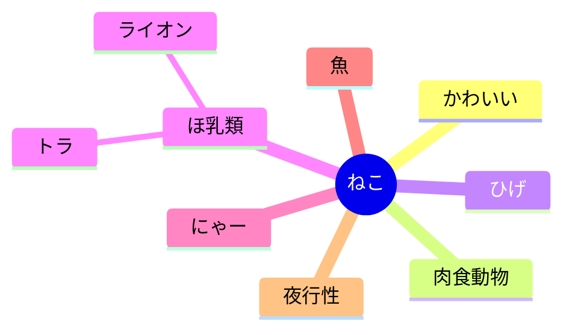

# IQ

<script setup>
import NetworkVisualization3D from './NetworkVisualization3D.vue'
</script>

<NetworkVisualization3D />

```yaml
テーマ: IQが高い人の特徴

情報処理:
- 連想力: 1つの情報から多くを思いつく
- 並列処理: 多くの情報を同時に扱える
- 情報整理: 情報を木構造で整理し、本質を抽出・抽象化できる
- 選別力: 情報の重要度を見極め、不要なものを排除できる
- 再構成力: 少ない情報から全体像を推測・復元できる

習慣:
- 考える癖がある

推論と創造:
- 予測力: 未来や他者の意図を的確に推測する
- 創造力: 情報を組み合わせて新たなアイデアや解決法を生む

脳の特徴:
- 神経結合が密で広範囲
- 作業記憶の容量が大きい
```




---

考える人の図解・言語化


```yaml
性格:
  - 好奇心旺盛
  - 感情と論理を分ける
  - こだわりが強い
  - 論理的・合理的
  - ストイック
  - 向上心がある
```


[IQが高い人が持つ特徴や悩みとは？IQの測り方や「高い」の基準について解説 | comotto | comottoコラム - NTTドコモ](https://comotto.docomo.ne.jp/column/00000176-2/)


意味ネットワーク
ニューラルネットワーク
脳の神経細胞のネットワーク
脳の神経ネットワークの構造


アルジャーノン
ケーキの切れない非行少年たち

[Data Sculptures | ZKM](https://zkm.de/en/data-sculptures)


