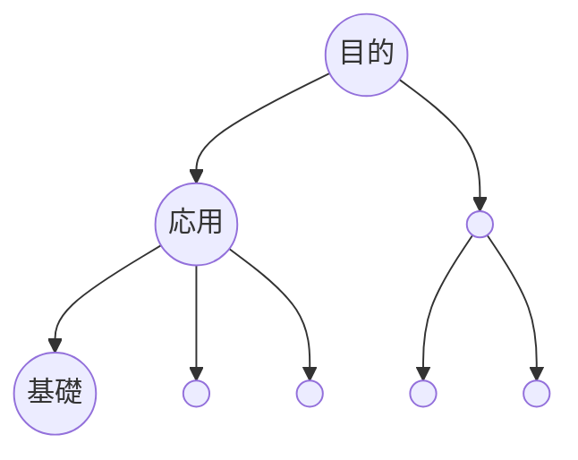

```yaml
タイトル: 勉強のコツ

勉強のコツ: 目的・実践ありきで勉強する（逆算式・トップダウン方式）

方法:
  - 学ぶ目的・活用場面・必要レベルを明確にする
  - 実践を進めながら必要と感じた知識・技能を随時学んでいく

メリット:
  - やるべきことが自然と分かる
  - 実用性を感じながら学べる
  - モチベーションを維持しやすい
  - 実践を通して必要な基礎を同時に学べる
```



