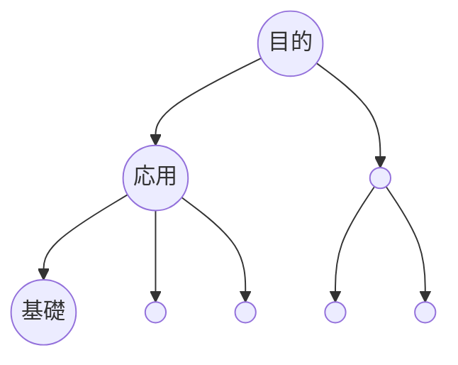

```yaml
タイトル: 勉強のコツ

勉強のコツ: 目的・実践ありき（逆算式）で勉強する

方法:
  - 学ぶ目的・活用場面・必要レベルを明確にする
  - 実践を進めながら必要と感じた知識・技能を随時学んでいく

メリット:
  - やるべきことが自然と分かる
  - 実用性を感じながら学べる
  - モチベーションを維持しやすい
  - 実践を通して必要な基礎を同時に学べる
```




---

勉強のコツの図解・言語化
- [トップダウン学習法の原則 - Claude](https://claude.ai/chat/c1417b14-6454-4fb5-a58d-809885796aae)
- [Effective Learning: Top-Down Strategy - Claude](https://claude.ai/chat/5cb22c79-dc34-48ad-96c3-cb069b8f3437)
- [トップダウン学習のYAML化](https://chatgpt.com/c/6849aece-aaf4-8013-bf8c-f807db31a2a4)
