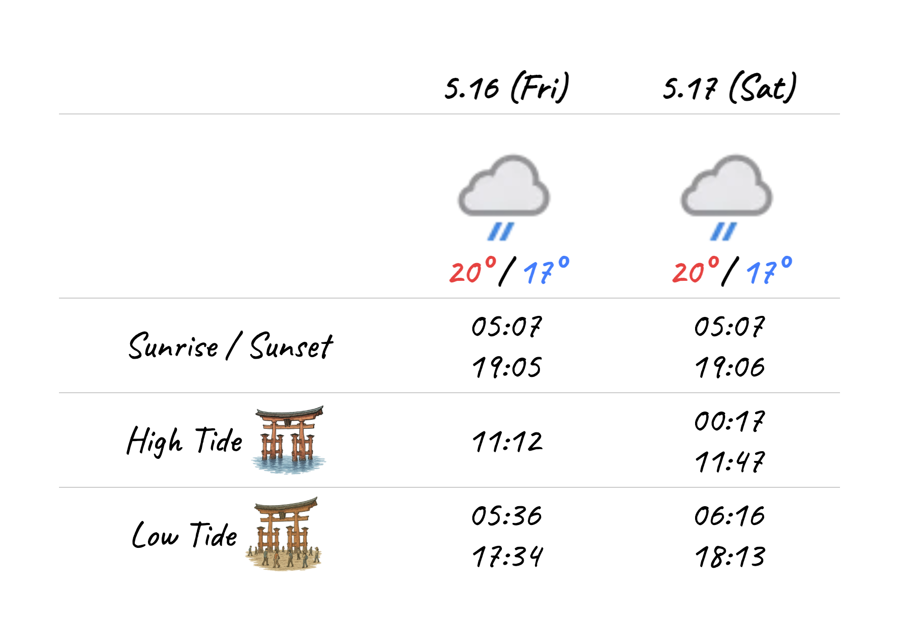

# Miyajima Tide

宮島の宿の受付にある、今日明日の天気・潮汐情報が書かれたホワイトボード
毎日手書きで更新している
それを電子化してみる

サイト：[Miyajima Tide](https://noy4.github.io/miyajima-tide/)
コード：[noy4/miyajima-tide](https://github.com/noy4/miyajima-tide)

## 要件
- 今日明日の天気・潮汐データを取得して表示
- 毎朝0時に自動更新

## コスト
- 公開先 - [GitHub Pages](https://pages.github.com/) - 無料
- 天気データ - [Free Weather API - WeatherAPI.com](https://www.weatherapi.com/) - 月100万リクエスト無料、商用利用OK
- 潮汐データ - [気象庁 | 潮汐・海面水位のデータ 潮位表　広島（HIROSHIMA）](https://www.data.jma.go.jp/kaiyou/db/tide/suisan/suisan.php?stn=Q8) > [テキストデータ版](https://www.data.jma.go.jp/kaiyou/data/db/tide/suisan/txt/2025/Q8.txt) - 政府標準利用規約に準拠して利用可、[参考](https://anko.education/apps/weather_api)

### その他
- ipad の電気代
- 何かあった時プロに頼まなければならなくなるというコスト

## 詳細
### TODO
ipad のブラウザで色の変更が反映されない問題
自動更新動いてるか要チェック

### 対応が必要なケース
データ取得元の仕様変更、サービス終了時

気象庁：
>仕様の継続性や運用状況のお知らせを気象庁はお約束していない

### 技術構成（開発者用）
- SvelteKit
- UnoCSS

### ホワイトボード電子化を進める前に
電子化の長所・短所
- 長所：手書き更新作業がなくなる
- 短所：味、温かみが減る

スタッフが受付滞在時に手書きで更新するのはそれほど手間か
天気やらを把握して案内の時に役立てられる？

### ホワイトボードの手書き更新の簡略化案
サイトを作って、
1. タブレットで表示して置いとく ✔︎
2. サイトのスクショをプリントした紙（毎日）を置いとく
3. QRコードをプリントした紙を置いとく

### データ候補
天気：
- [Weather API - OpenWeatherMap](https://openweathermap.org/api) - 月100万リクエスト無料、明日の天気の要約が無料枠に含まれない（3時間ごとの予報から自分で計算）
- [🌤️ Free Open-Source Weather API | Open-Meteo.com](https://open-meteo.com/) - 商用の場合€29/月
- [気象情報API - YuMake株式会社](https://www.yumake.jp/weather-api/) - 天気・日の出入り・潮汐、それぞれ月2000円程度で利用可 + 初期費用16,000円

潮汐：
- [WorldTides - Developer](https://www.worldtides.info/developer) - $5/月
- [日本沿岸736港の潮汐表 - tide736.net](https://tide736.net/) - 無料
- [釣りコミュニティーサービス[fishstar]](https://fishing-community.appspot.com/tidexml/doc) - 商用32,400円/年

日の出入り：
- [Sunset and Sunrise Times API (Free) - SunriseSunset.io](https://sunrisesunset.io/api/) - 無料

### 試算
データリクエスト回数がどんな感じになるか計算してみる

毎朝0時取得：1日1回 x 30日間 = 30回/月
6時間おきに取得：1日4回 x 30 = 120/月
1時間おき：1日24回 x 30 = 720/月

### データ取得方法
#### 方法1
潮汐データが載ったサイトに自動でアクセスしてデータを抜き取る（スクレイピング）
- スクレイピングは注意が必要（サイトにいろんな場所から大量のアクセスがくるとサーバーに負担がかかるので規約で禁じているところがあったりモラル的に良くなかったりする。そのサイトもどこかにお金を払ってデータ取得してるかもしれないわけで。1箇所から数回とか（人がアクセスするのと同じ頻度）ならまあいいかなくらい。）
- 対象サイトのデザインが変わった時に対応が必要
- サイトがブラウザ上で動くプログラムからのアクセスを禁じていることがある（セキュリティ上の理由、ユーザー保護）。その場合サーバー側で動くプログラムを用意する必要がある（余分に別環境を用意する必要があり、高く付く）。

#### 方法2
潮汐データを提供してくれるサービスを探して使う（API）
- 大抵金がかかる（月500円、2000円、10,000円、色々）
- 課金する場合、サーバー側で動くプログラムを用意する必要がある。発行したアクセスキーを隠すため。
- 国とか気象庁とかが無料でデータを使っていいようにしてくれてることがある

### その他
[[調査レポート]]

### メモ
[2025年1月｜年間潮汐・潮見表｜一般社団法人宮島観光協会](https://www.miyajima.or.jp/sio/sio01.php)
おそらく気象庁の潮汐データを使っている

[Free Weather API - WeatherAPI.com](https://www.weatherapi.com/) の精度が怪しい説

[Miyajima Tide Times | 7 Day Tide Chart | TideTime.org](https://www.tidetime.org/asia/japan/miyajima.htm)

