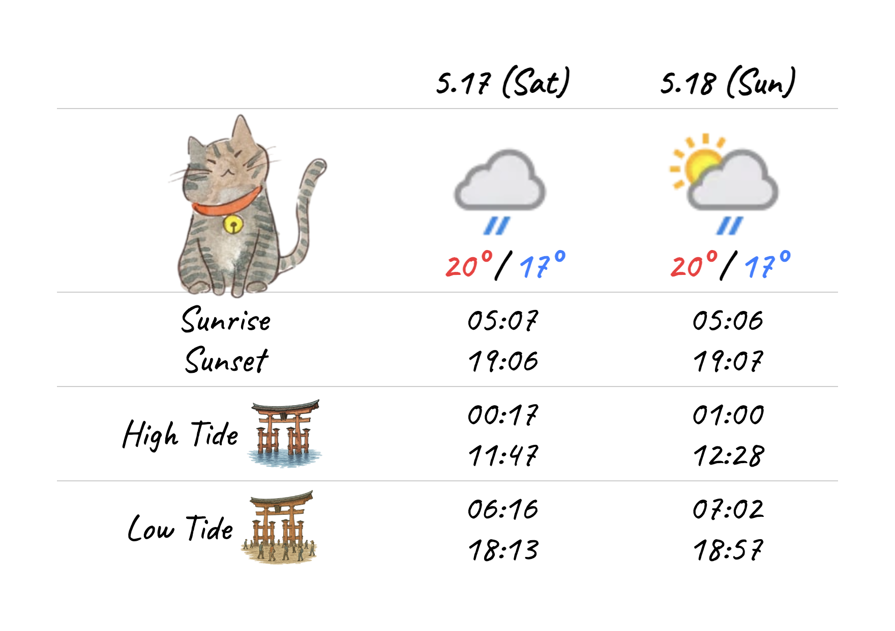

# Miyajima Tide

宮島の宿の受付にある、今日明日の天気・潮汐情報が書かれたホワイトボード
毎日手書きで更新している
それを電子化してみる

サイト：[Miyajima Tide](https://noy4.github.io/miyajima-tide/)
コード：[noy4/miyajima-tide](https://github.com/noy4/miyajima-tide)

## 要件
- 今日明日の天気・潮汐データを取得して表示
- 毎朝0時に自動更新

## 使ったデータ
- 天気 - [Free Weather API - WeatherAPI.com](https://www.weatherapi.com/): 月100万リクエスト無料、商用利用OK
- 潮汐 - [気象庁 | 潮汐・海面水位のデータ 潮位表　広島（HIROSHIMA）](https://www.data.jma.go.jp/kaiyou/db/tide/suisan/suisan.php?stn=Q8): 政府標準利用規約に準拠して利用可、[参考](https://anko.education/apps/weather_api)

（注意）データ取得元がサービス終了した、などでデータが取れなくなった時は対応が必要

気象庁：
>仕様の継続性や運用状況のお知らせを気象庁はお約束していない

## 試算
データリクエスト回数がどんな感じになるか計算してみる

毎朝0時取得：1日1回 x 30日間 = 30回/月
6時間おきに取得：1日4回 x 30 = 120/月
1時間おき：1日24回 x 30 = 720/月

あんま頻繁に取得しても気象庁さんのサーバーに申し訳ない