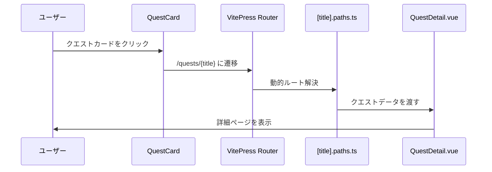

# クエスト詳細ページ実装計画

## 概要

現在のクエスト情報を使って、VitePressのDynamic Routesを活用したクエスト詳細ページを実装します。シンプルに現在の情報のみで、レイアウトを詳細ページ向けに最適化したものを作成します。

## 現状分析

### 現在のプロジェクト構造

```
docs/quests/
├── index.md          # クエスト一覧ページ
├── quest.data.ts     # クエストデータローダー
├── quest.data.md     # クエストデータソース
├── QuestView.vue     # クエスト一覧表示コンポーネント
├── QuestCard.vue     # クエストカードコンポーネント
└── quest_cleared.png # クリア済みバッジ画像
```

### 技術スタック

- VitePress 2.0.0-alpha.5
- Vue 3.5.16
- UnoCSS 66.1.3
- TypeScript

### 現在のクエストデータ構造

```typescript
export interface Quest {
  icon?: string
  title: string
  target?: string
  description?: string
  status?: Status
}

export type Status = 'active' | 'cleared'
```

### 既存の実装

- [`QuestCard.vue`](docs/quests/QuestCard.vue:14)で既に`/quests/${quest.title}`へのリンクが設定されている
- [`quest.data.ts`](docs/quests/quest.data.ts:36-83)でクエストデータが構造化されている
- [`parseQuestData`](docs/quests/quest.data.ts:36)関数でMarkdownからデータを解析

## 実装計画

### 1. ファイル構成

```
docs/quests/
├── [title].md         # 動的ルートテンプレート（新規作成）
├── [title].paths.ts   # パスローダー（新規作成）
├── QuestDetail.vue    # クエスト詳細表示コンポーネント（新規作成）
└── （既存ファイル群）
```

### 2. 動的ルート設定

#### **[title].paths.ts**
- [`quest.data.ts`](docs/quests/quest.data.ts:36-83)の[`parseQuestData`](docs/quests/quest.data.ts:36)関数を活用
- 全クエストのタイトルをパラメーターとして生成
- 各クエストの完全なデータをcontentとして渡す

```typescript
// 実装例
export default {
  async paths() {
    const questData = await parseQuestData(src)
    const paths = []
    
    for (const section of questData) {
      for (const quest of section.items) {
        paths.push({
          params: { title: quest.title },
          content: quest
        })
      }
    }
    
    return paths
  }
}
```

#### **[title].md**
- 動的ルートテンプレート
- VueコンポーネントでQuestDetail.vueを呼び出し
- `$params.title`でクエストタイトルを取得
- SEO最適化のためのメタデータ設定

### 3. 詳細ページコンポーネント

#### **QuestDetail.vue**
- 現在の[`QuestCard.vue`](docs/quests/QuestCard.vue:1-41)をベースに詳細ページ向けにレイアウト最適化
- 以下の要素を含む：
  - より大きなアイコン表示
  - 説明文の可読性向上
  - ステータス表示の強化
  - レスポンシブデザイン対応

#### デザイン方針
- 現在のデザインシステムとの一貫性を保持
- UnoCSS/Tailwindクラスを使用したスタイリング
- モバイルファーストのレスポンシブデザイン

## システム構成図

```mermaid
graph TD
    A[quest.data.md] --> B[quest.data.ts]
    B --> C[parseQuestData関数]
    C --> D[クエストデータ配列]
    
    D --> E[QuestView.vue]
    E --> F[QuestCard.vue]
    F --> G[詳細ページリンク]
    
    D --> H[[title].paths.ts]
    H --> I[動的パス生成]
    I --> J[[title].md]
    J --> K[QuestDetail.vue]
    
    style A fill:#e1f5fe
    style J fill:#f3e5f5
    style K fill:#f3e5f5
```

## データフロー



## 実装手順

### Phase 1: 基本構造の実装
1. **[title].paths.ts** の作成
   - [`quest.data.ts`](docs/quests/quest.data.ts:28-34)のcreateContentLoaderを参考に実装
   - 全クエストのパスとデータを生成

2. **[title].md** の作成
   - 動的ルートテンプレートの実装
   - メタデータとSEO対応

### Phase 2: コンポーネント実装
3. **QuestDetail.vue** の作成
   - [`QuestCard.vue`](docs/quests/QuestCard.vue:8-40)のレイアウトを詳細ページ向けに拡張
   - UnoCSS/Tailwindクラスを使用したスタイリング

### Phase 3: テスト・調整
4. **動作確認**
   - 各クエストページの動作確認
   - レスポンシブデザインの調整
   - SEO最適化
   - パフォーマンス確認

## 期待される結果

### URL構造
- `/quests/音の鳴る方へ` のようなURLで各クエストの詳細ページにアクセス可能
- 現在の `/quests/[title]` の構造をそのまま使用

### 表示内容
- 現在のクエスト情報（アイコン、タイトル、ターゲット、説明、ステータス）を詳細ページ向けに最適化して表示
- 既存のデザインシステムとの一貫性を保持
- モバイル・デスクトップ両対応のレスポンシブデザイン

### 技術的な利点
- VitePressの静的サイト生成の恩恵を受ける
- SEO最適化された個別ページ
- 高速なページ読み込み
- 既存のデータ構造を活用した効率的な実装

## 注意事項

- クエストタイトルに日本語が含まれるため、URLエンコーディングの対応が必要
- 既存のリンク構造を壊さないよう注意
- ビルド時間への影響を最小限に抑える

## 次のステップ

この計画に基づいて実装を開始し、各フェーズごとに動作確認を行いながら進めます。