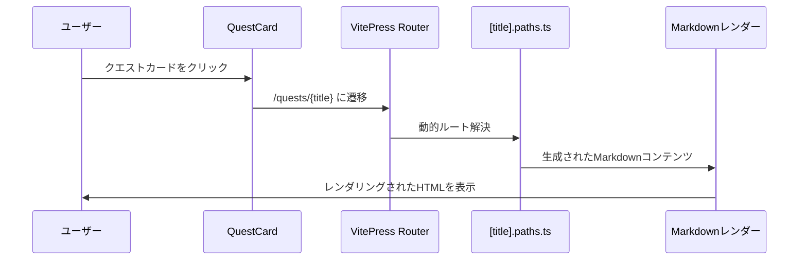

# クエスト詳細ページ実装計画（シンプル版）

## 概要

VitePressのDynamic Routesの「Rendering Raw Content」機能を使用して、`<!-- @content -->`でクエストの詳細情報を表示するシンプルな実装パターンです。

## アプローチの違い

### 通常版 vs シンプル版

| 項目 | 通常版 | シンプル版 |
|------|--------|-----------|
| 実装方法 | Vueコンポーネント使用 | `<!-- @content -->`使用 |
| カスタマイズ性 | 高い | 低い |
| 実装の複雑さ | やや複雑 | シンプル |
| デザインの自由度 | 高い | Markdownに依存 |
| メンテナンス性 | 要Vue知識 | Markdownのみ |

## 実装計画（シンプル版）

### 1. ファイル構成

```
docs/quests/
├── [title].md         # 動的ルートテンプレート（新規作成）
├── [title].paths.ts   # パスローダー（新規作成）
└── （既存ファイル群）
```

**注意**: この方式ではVueコンポーネント（QuestDetail.vue）は不要です。

### 2. パスローダーの実装

#### **[title].paths.ts**

```typescript
import fs from 'fs'
import { parseQuestData } from './quest.data'

export default {
  async paths() {
    // quest.data.mdからデータを読み取り
    const src = fs.readFileSync('docs/quests/quest.data.md', 'utf-8')
    const questData = await parseQuestData(src)
    
    const paths = []
    
    for (const section of questData) {
      for (const quest of section.items) {
        // 各クエストの詳細コンテンツをMarkdownで生成
        const content = generateQuestMarkdown(quest, section)
        
        paths.push({
          params: { title: quest.title },
          content // Raw contentとして渡す
        })
      }
    }
    
    return paths
  }
}

function generateQuestMarkdown(quest, section) {
  return `# ${quest.icon} ${quest.title}

${quest.status === 'cleared' ? '✅ **クリア済み**' : '🔄 **進行中**'}

## ターゲット
${quest.target || '未設定'}

## 説明
${quest.description || '説明がありません'}

## セクション
${section.title || 'その他'}

---
[← クエスト一覧に戻る](/quests/)
`
}
```

### 3. 動的ルートテンプレート

#### **[title].md**

```markdown
---
title: "{{ $params.title }}"
description: "クエスト詳細ページ"
---

<!-- @content -->
```

## システム構成図（シンプル版）

```mermaid
graph TD
    A[quest.data.md] --> B[quest.data.ts]
    B --> C[parseQuestData関数]
    C --> D[クエストデータ配列]
    
    D --> E[QuestView.vue]
    E --> F[QuestCard.vue]
    F --> G[詳細ページリンク]
    
    D --> H[[title].paths.ts]
    H --> I[generateQuestMarkdown関数]
    I --> J[Markdownコンテンツ生成]
    J --> K[[title].md]
    K --> L[<!-- @content -->で表示]
    
    style A fill:#e1f5fe
    style K fill:#f3e5f5
    style L fill:#f3e5f5
```

## データフロー（シンプル版）



## 実装手順（シンプル版）

### Phase 1: パスローダーの実装
1. **[title].paths.ts** の作成
   - [`parseQuestData`](docs/quests/quest.data.ts:36)関数を活用
   - `generateQuestMarkdown`関数でMarkdownコンテンツを生成
   - 各クエストのデータをcontentプロパティに渡す

### Phase 2: テンプレートの作成
2. **[title].md** の作成
   - `<!-- @content -->`でコンテンツを表示
   - 基本的なメタデータ設定

### Phase 3: 動作確認
3. **テスト**
   - 各クエストページの表示確認
   - Markdownレンダリングの確認
   - リンクの動作確認

## 生成されるコンテンツ例

```markdown
# 🎹 音の鳴る方へ

🔄 **進行中**

## ターゲット
「♪ピアノがこんな簡単だなんて知らなかったんだ」の作成

## 説明
[[ピアノがこんな簡単だなんて知らなかったんだ]]

## セクション
その他

---
[← クエスト一覧に戻る](/quests/)
```

## メリット・デメリット

### メリット
- **実装が簡単**: Vueコンポーネント不要
- **学習コストが低い**: Markdownの知識のみ
- **軽量**: 追加のJavaScriptが不要
- **SEO対応**: 完全に静的なHTML
- **メンテナンス性**: Markdownテンプレートの修正のみ

### デメリット
- **デザインの制約**: Markdownの表現力に依存
- **インタラクティブ要素**: 追加困難
- **レイアウトの自由度**: 限定的
- **コンポーネント再利用**: 不可

## 適用シーン

### このパターンが適している場合
- シンプルな情報表示で十分
- 実装・メンテナンスコストを重視
- Markdownベースのコンテンツ管理を好む
- デザインよりもコンテンツを重視

### 通常版を選ぶべき場合
- カスタムデザインが必要
- インタラクティブな要素が必要
- 複雑なレイアウトが必要
- 既存のVueコンポーネントとの統合が必要

## 実装例の詳細

### generateQuestMarkdown関数の拡張例

```typescript
function generateQuestMarkdown(quest, section) {
  const statusBadge = quest.status === 'cleared' 
    ? '✅ **クリア済み**' 
    : quest.status === 'active' 
      ? '🔄 **進行中**' 
      : '📋 **未着手**'

  const targetSection = quest.target 
    ? `## ターゲット\n${quest.target}\n` 
    : ''

  const descriptionSection = quest.description 
    ? `## 説明\n${quest.description}\n` 
    : ''

  const sectionInfo = section.title 
    ? `## セクション\n${section.title}\n` 
    : ''

  return `# ${quest.icon || '📝'} ${quest.title}

${statusBadge}

${targetSection}
${descriptionSection}
${sectionInfo}

---
[← クエスト一覧に戻る](/quests/)

*最終更新: ${new Date().toLocaleDateString('ja-JP')}*
`
}
```

## 次のステップ

1. どちらのパターンで実装するかを決定
2. 選択したパターンに基づいて実装開始
3. 動作確認とテスト
4. 必要に応じて調整・改善

## 推奨事項

**初期実装**: シンプル版から始めて、必要に応じて通常版に移行することを推奨します。これにより：
- 早期にプロトタイプを作成可能
- 要件の明確化が可能
- 段階的な機能拡張が可能